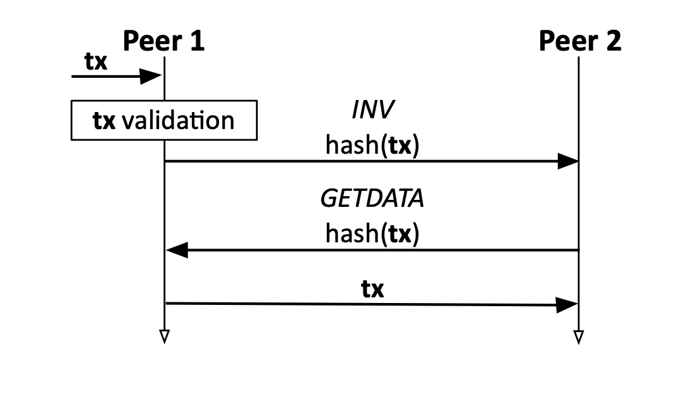
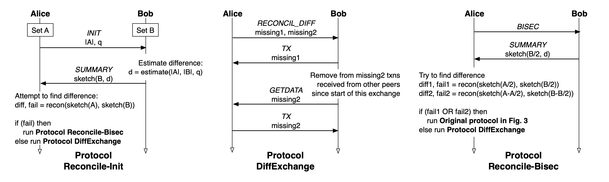
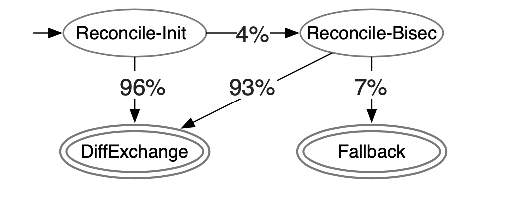

__*从本质上来看，这是一个在点对点网络中如何使得2个节点的数据更高效的同步为一致的问题。*__

目前运营一个比特币节点所消耗总带宽的一半，仅用于广播交易。与区块的广播不同，
交易的广播在以往的工作中很少受到关注。原始的比特币 p2p 网络中
广播交易使用的是简单的 flooding （洪泛）策略。

本文介绍一种新的交易广播协议 Erlay，其可以减少 40% 的带宽消耗，而且
在节点连接数增加时，可以使带宽的增长按照常数级的方式增长，而不是现在
的线性增长。Erlay 协议的提议目前已经提交到比特币社区，未来很有可能被
引入到比特币协议升级中。

## 问题

我们先来看看现在比特币协议中，一个 transaction 的生命周期是怎样的。

Erlay 协议主要讨论的是图中第二个方块中所描述的交易广播策略。不涉及到交易打包进
块之后区块的广播策略。

由图可见，一个交易被广播到某个节点后，又会继续被广播到所有它所连接的其他节点上。
那么一个交易就会被广播很多次，这样的策略是比较浪费带宽的。一个交易在 2 个节点间的传播如下图所示，

节点会把交易的哈希值放在 INV message 中用以询问另一节点是否有该交易, 如果没有，则调用 GETDATA 获取交易。

## Erlay 协议设计

那么如何高效的找出 2 个节点 Alice 和 Bob 之间交易集合的差异，然后进行传输？

Erlay 中，节点之间进行交易核对(reconciliation) 通过如下办法，首先计算出一个
由交易集合经过 pinsketch 算法计算得出的草图(sketch)。草图有如下的性质：

- 草图有一个预先确定的容量，当 sketches 中的元素数量不超过容量时，可以把整个集合恢复。
- 两个集合之间的差集的 sketch，可以从 2 个集合所构造的 sketch 进行 xor 运算得到
  的结果中得到恢复。

__所以，可以把节点中所有的交易都编码到 sketch 中，然后对2个节点的 sketch 进行 xor 
	操作得到差集的草图。只要差集的大小 <= sketch 的容量，我们就能恢复出所有差集。
	因此，还需要估算2个节点之间交易集合差集的大小。__

> 定义:
> - D: 2个集合的差集大小 
> - d: 对 D 的 估算
> - q: 用来计算 d 的参数

那么令 `d = abs(|A| − |B|) + q * min(|A|, |B|) + c`

首先两个集合求差集的结果是不小于集合大小的差值的，再把较小集合乘以 q 作为一个因子加上，c = 1 以防止:
`|a| = |B|` 和 `q * min(|a|, |B|) = 0 时 d = 0`

如何计算q的值呢？ 初始轮，设置 q = 0，随后每一轮，用 D 来更新 q 的值:

`q = (D − abs(|A| − |B|)) / min(|A|, |B|)`

这样做是基于一个假设：网络中每个节点的 q 值是一个常量。

那么有了对差集大小的估算，2 个 transactions 集合的核对协议如下

1. Alice 把集合大小 |A| 和 q 发送给 Bob 。
2. Bob 根据 |A|,|B|, q 计算出 d , 然后计算草图 sketch(B, b) 并发送给 Alice 。
3. Alice 计算自己的草图 sketch(A, b), 然后对 2 个草图进行 xor 运算。
	此刻有 2 种情况，d 的估算可用，则根据 diff hash 的集合 调用 GETDATA 获取差异的交易。
4. 如果 d 的估算不可用，则会采用二分策略重新计算差集

	`diff1 = sketch(B/2, d), sketch(A/2, d)`
	
	`diff2 = sketch(B-B/2, d), sketch(A-A/2, d)`
	
	即 Alice, Bob 对一半的元素进行草图的 xor 运算，然后再对另外一半进行 xor 运算。
	2 个 diff 的结果即为总的交易差集。如果 diff1 或者 diff2 计算失败了，则回退到
	比特币的原始 tx relay 协议。

注意到步骤 4 还有一个更直观的办法是重新估算一个更大的 d 值，然后 Bob 重新计算
sketch(B, b)，再传给Alice。这样也是可行的，但之前传输的 sketch 就无效了，这种策
略是比较低效的。

而用二分策略的好处是，可以复用之前的 sketch, Bob 只要再把 sketch(B/2, b) 
传输给Alice, 那么 Alice 就能算出

`sketch(B-B/2, b) = sketch(B, b) xor sketch(B/2, b)`

比特币网络中上述3种可能状态的实验占比为：

也就是说有 `96% + 4% * 93% = 99.72%` 的交易通过 erlay 的协议进行广播。
只有 0.28% 的交易会退回到 flooding

## 总结

本文先介绍了原始的 transaction relay 协议 flooding, 然后介绍了 Erlay 的核心协议：如何把 2 集合编码到长度小于其差集大小的序列中，并恢复其差集，
以及估算 2 个集合差集大小的协议。

## 参考

1. [Bandwidth-Efficient Transaction Relay for Bitcoin](https://arxiv.org/abs/1905.10518)

2. [The mathematics of Minisketch sketches](https://github.com/sipa/minisketch/blob/master/doc/math.md)
