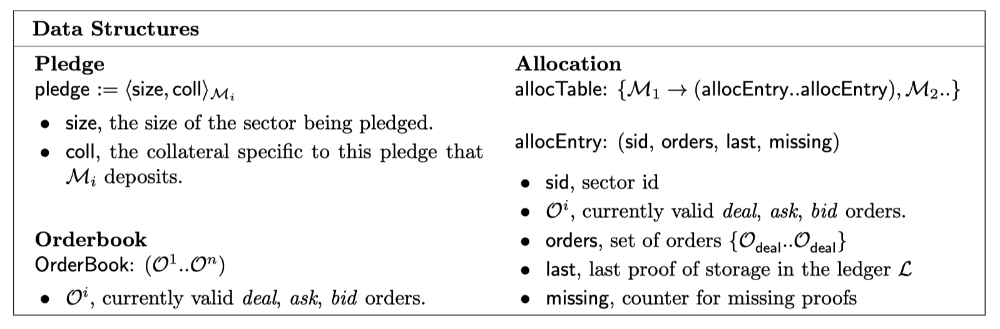
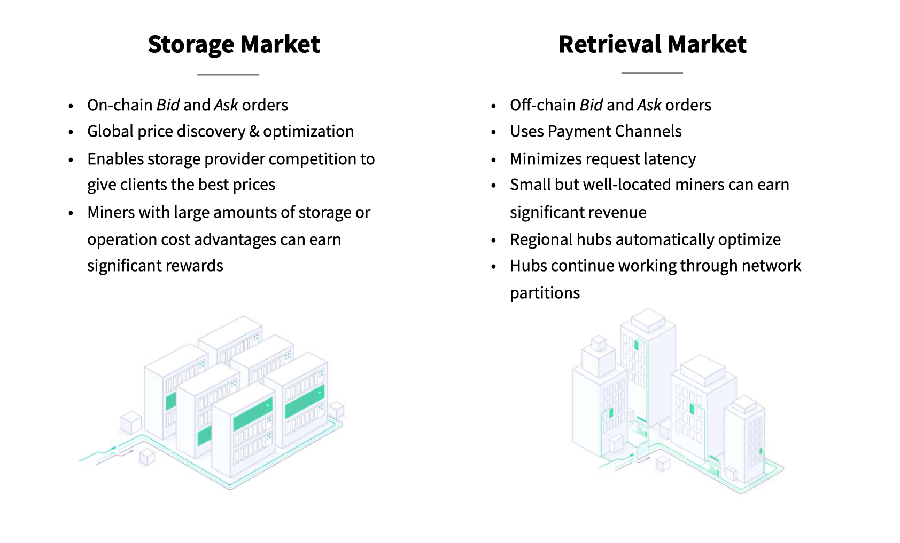
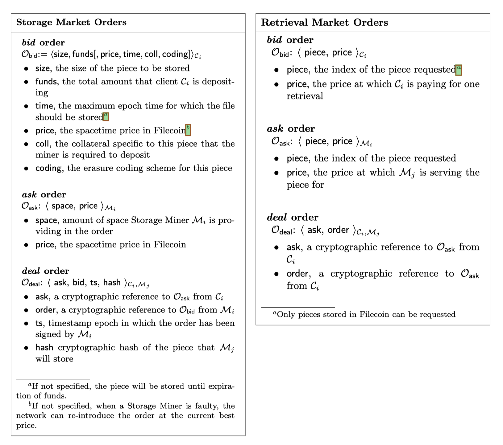

就在几天前，Protocol Labs 启动了 Filecoin 测试网，预计2020年一季度上线主网。新闻一出来，当年这个红极一时的明星项目又引起圈内一阵反响。大家所熟知的 IPFS 也是由 Protocol Labs 主导开发，该协议已经稳定运行几年了。IPFS 是一个点对点的分布式文件系统，但是光有 IPFS 是不够的，缺少必要的激励机制，整个系统无法形成有效的闭环，构建在 IPFS 之上的 Filecoin 就是为了解决这一问题。它提供了一个供需市场，存储提供者和存储使用方可以通过竞价的模式去达成交易，最终，通过市场来调节存储的成本，使用方能够根据价格选择速度、冗余程度和成本。在这篇文章中，我们聊聊 [Filecoin paper](1) 是怎么做的。

## 基本构造

在介绍具体的交互之前，先介绍 Filecoin 的几个关键概念。

### 参与方

参与 Filecoin 协议的有客户端(Client)，存储矿工（Storage Miner），检索矿工（Retrieval Miner）。

- 客户端需要 1. 付钱给存储旷工来存储自己的数据，2. 付钱给检索矿工来获取数据。
- 存储矿工向网络提供数据存储，保存来自客户端的数据，并不断的向链证明自己确实保存了客户的数据。
- 检索矿工向客户端提供数据获取的服务。

存储旷工和检索矿工组成了 Filecoin 的网络，并不断生成账本，构建 Filecoin 区块链。

### 数据结构

- Pieces：用户的数据可能会被分成多个 pieces，并且不同的 pieces 可能由不同的存储矿工保存。
- Sectors：sector 本意是扇区，这里指代的是存储矿工节点上的一部分存储空间。存储矿工需要先向链声明自己的 sectors，然后才可以对外提供服务，将客户端的 pieces 存储在 sectors 中。
- Pledge：存储矿工在向链声明自己的 sectors，还需要抵押一部分的资金，pledge 用来保存要声明的 sector 大小以及对应的抵押的资金。（资金就是 Filecoin 代币）
- AllocationTable：分配表保存了 pieces 和 sectors 和对应关系。
- Orders：Filecoin 中的参与方想要提供服务和请求使用服务时，都会发起一个 order。客户端的order 称作  *bid order*，存储矿工和检索矿工的order 叫做 *ask order*。
- Orderbook：订单记录保存了一系列的订单。

更详细的说明可以参考 [Filecoin paper](1) 的 *4.2* 节。

## 供需市场

Filecoin 网络中存在两个市场，Storage Market 和 Retrieval Market。这两个市场只是个抽象的概念。你可以把它们理解成电子商城，有人卖货，有人买货，有人的地方就有市场，但市场并没有实体存在。在 Storage Market 中，卖货是存储节点售卖自己的存储，买货是客户端付钱购买存储节点的存储。Retrieval Market 中，卖货就是检索节点售卖自己高速的数据供应能力，买货是客户端付钱查询节点数据。

Storage Market 和 Retrieval Market 两者在概念上比较类似，但具体实现千差万别。比如说，Storage Market 中的 OrderBook 存储在链上，而 Retrieval Market 中的交易完全是链下交易，client 和 miner 在链下通过 Network 匹配需求，然后线下开支付通道完成付款。下图给出了两者的主要特征。本文着重在原理，具体细节留待后续文章分析。下文的介绍主要以 Storage Market 的流程为主。

#### 供给

说到交易市场，必然先保证供给。在 Storage Market 中，存储能力由 Storage Miner（以下简称 miner） 提供。miner 在挂载好可用的存储（这里的存储不局限于本地磁盘）后，第一件事情就是调用 `PledgeSector` 提交一个交易到链上**声明自己的可用存储**，这个过程叫做 *Pledge*，你可以理解成 miner 把一份承诺书写到链上，承诺书上写明了 miner 要提供多大的存储空间，以及一定数量的保证金（`collateral`）。保证金用于后续 miner 作恶时所需的惩罚金。*Pledge* 交易会更新 `AllocTable` ，写入承诺书上的 sector。

> PledgeSector:
>
> - 输入：
>   - 当前的 `alloc table`
>   - pledge 请求 `pledge`
> - 输出：
>   - 新的 `allocTable'`

#### 生成订单

Pledge 完成后，miner 就可以对外提供存储服务了。miner 生成 *ask order* ，里面标明以什么价格出售多少存储空间， 然后执行 `AddOrders` 交易把 order 写入到链上。

上面是 miner 生成 ask order 的过程，ask orders 构成了存储市场上的供给侧。

如果 client 想要把自己的数据存储到 miner 那里（也就是需求侧），也要往链上添加一个订单，叫做 `bid order`，订单里面标明了要存的数据大小，以及 client 愿意支付的金额（`fund`），可能还会有数据要保存多长时间，以及对 miner 的保证金（`collateral`）的最低要求。

>AddOrders
>
>- 输入：订单列表 O~1~ .. O~n~
>- 输出：bit `b`, 1 成功，0 失败

#### 订单匹配

client 和 miner 把自己的 order 上链后，就可以调用 `MatchOrders` 来匹配对方的 order。具体的匹配算法，论文中没有做详细说明。暂时还没有看过这部分代码，这里我做一个不负责任的猜测，内部实现多种不同的匹配策略，client 和 miner 在做订单匹配的时候，可以指定使用哪一种匹配策略。有兴趣的可以去翻一下代码 [go-filecoin](2) 或者 [lotus](3)。

> MatchOrders
>
> 输入：
>
> - 当前的 OrderBook
> - 要匹配的订单 O^q^
>
> 输出：匹配上的订单 O^1^ .. O^n^

#### 签订合同

当 client 发现自己的订单和 miner 的匹配上后，双方需要走 **签合同 **的流程。签合同需要处理两个事宜。

一数据传输，client 端需要把自己的数据发送给 miner，miner 需要接收并保存 client 的数据。

二，数据传输完成后， miner 生成一个 `deal order`（其中包含了用户数据的哈希值），签名后，发送给 client，client 收到后，也签名，然后提交到链上，表示合同已签订。

在收到 `deal order` 后，链就更新 `allocTable`，标记 miner 的 sector 和 用户数据（哈希值）之间的关系。

至此，一个完整的合同就达成了。

关于 order 的详细定义可参考下图：

## 履约

但是，合同签完了，后续万一 miner 拒不执行合同，把 client 的数据（pieces）丢弃了，该怎么办？如何保证 miner 诚实的履行合同的职责？本章节介绍 filecoin 协议中的 *Seal* 和 *Prove* 操作，我称之为 **履约**。（ *PoRep* 和 *PoSt*）

Miner 在和 client 签订完合同后，需要做两个事情。

#### Seal

sector 填满了数据，miner 需要调用 `SealSector`  将 sector 密封起来，并将 seal 结果上链。该操作是为了证明 miner 确实将 sector 中的各个 client 的数据（pieces）都完整无缺的存储下来。

>SealSector:
>
>- 输入：
>  - miner 的秘钥对 `M`
>  - sector 索引标识 `j`
>  - 分配表 `allocTable`
>- 输出：
>  - π~seal~
>  - root hash `rt`

值得注意的是 SealSector 的输出 π~root~ 和 `rt` 是 Filecoin 存储证明 *PoRep* 中第一步操作（`PoRep.Setup`）的输出。*PoRep* 利用了 [*zk-SNARKs*](4) 技术，因此， SealSector 操作比较耗费计算。Setup 的数据就是 sector `j` 所存储的所有 clients 数据。

#### Prove

*Seal* 操作的结果证明了，miner 在某一时刻存储了 clients 的数据，但在这之后，miner 可能会直接将数据丢弃，欺骗客户。这就需要 miner 能够持续不断的证明自己存有正确的数据。这是通过 Filecoin 时空证明 *PoSt* 完成的。*PoSt* 要求 miner 在每个 epoch 都需要提交 sector 的 prove 到链上。这个 prove 通过 `PoSt.Prove` 生成。

> ProveSector:
>
> - 输入：
>   - miner 的秘钥对 `M`
>   - sector 索引标识 `j`
>   - 挑战值 `c`
>   - 时间参数 `t`
> - 输出：证明 π~Post~

和 Seal 不同的是，Prove 需要一个时间参数 `t`（比如，区块高度），`PoSt.Prove` 利用这个时间 t 来证明自己在 t 时刻，存储有 sector `j` 中的数据。和 Seal 类似的是， Prove 操作也比较耗费计算，Filecoin 中所谓的挖矿就是和这两个操作有关。每当 miner 提交了一份正确的 proof 到链上，链在下一次 epoch 做 check 时，会把来自client 订单中的 *fund* 按照比例付给 miner，直到 client 订单过期或者fund 使用完。

关于 `PoRep` 和 `PoSt` ，说到底还是需要依靠 [zk-SNARKs](4)，关于这一部分，大家有兴趣的可自行翻阅其他文献，这里就不班门弄斧了，推荐安比实验室写的[一系列文集](5)，比较通俗易懂。

上面说的都是诚实 miner 的行为，假如 miner 作恶，没有定期提交 proof。那链在检查 allocTable 时，就会发现某个用户数据（piece）没有相对应的 miner proof，这个时候，前面提到 miner pledge 质押的保证金 (`collateral`) 就派上用场了。链会扣掉和 piece 成比例的保证金，返还给 client。

## 结语

这篇文章介绍了 Filecoin 协议的基本原理，涉及了供需市场，订单，合同执行，以及最后的履约，试图以相对具象的概念向大家传达 Filecoin  paper 中展现的内容。当然，以上都是我的片面理解，如有任何概念上的误导，都归于我个人，一切以论文和源代码为主，也欢迎相关领域的朋友指正。

事实上，论文中还有一部分内容本文没有涉及：共识。文中提到的 `AddOrders` , `Pledge`等等操作大部分都需要上链，而链需要 miner 共同维护，对上链的交易达成共识。Filecoin 用了哪种共识协议，PoW 还是 PoS？挖矿是怎么一回事？链的激励机制又是如何运作的？这一块的内容，我们留待下回分解。

[1]: https://filecoin.io/filecoin.pdf
[2]: https://github.com/filecoin-project/go-filecoin
[3]: https://github.com/filecoin-project/lotus
[4]: https://en.wikipedia.org/wiki/Non-interactive_zero-knowledge_proof
[5]: https://github.com/sec-bit/learning-zkp/blob/master/zkp-resource-list.md

