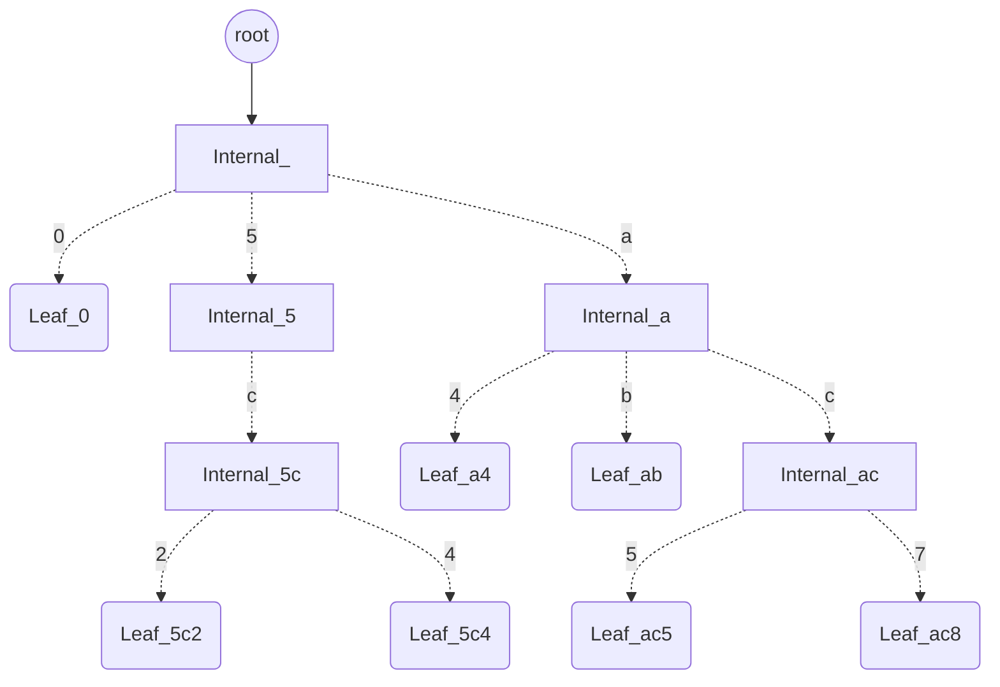
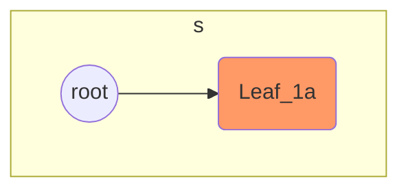
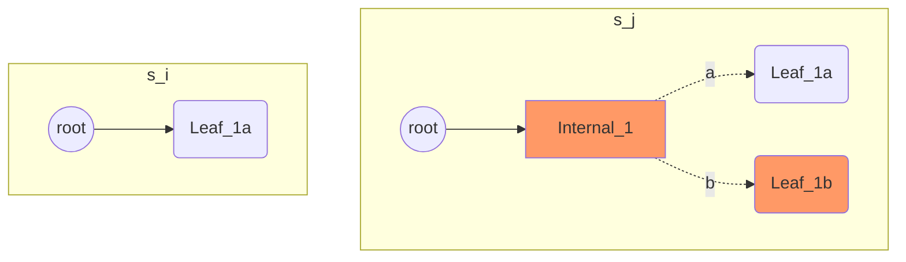
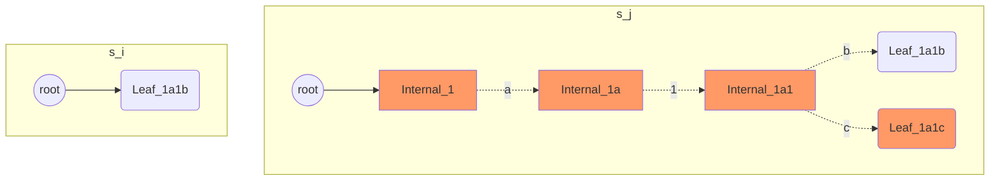
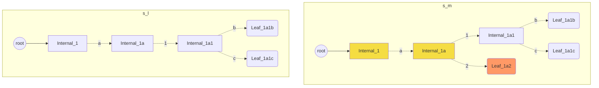

# Jellyfish Merkle Tree in Libra Blockchain

本文介绍了 Libra 中用来存储区块链状态数据的数据结构，Jellyfish Merkle Tree(JMT)。文章首先概述了 JMT 在 Libra 中扮演的角色，作用，及其主要的特征；然后重点阐述其接口以及内部实现；最后，拿它和以太坊的 MPT 树做对比，聊一聊它的优缺点。

Libra 在设计上和以太坊比较类似，都属于账户模型，但不同于以太坊把合约数据存储在一个单独的合约账户中，Libra 把合约数据抽象成 Resource，直接存储到账户下面（合约代码 Module 也是直接存储到账户中，代码即数据，两者在 Libra 存储中有着相同的地位）。当用户用了某个合约，合约产生的数据就放到用户账户下。因此，Libra 账户下，会包含有多个合约的多种 Resource。Jellyfish Merkle Tree 就是用来存储这些 **(account_address，resources/modules)** 的，重要性可见一斑。但是Libra 使用的共识是 PBFT（计划中会转向类 PoS 的共识），不存在分叉回滚这种说法。所以 JMT 的实现，和以太坊 Merkle Patricia Tree[^1] 有些不同，不需要考虑分叉的问题。

> 以下，需要读者对以太坊 MPT 树有一定的了解，建议先阅读下文后的相关资料，以更好的理解 JMT。

MPT[^2] 中，kv 对的查询，插入都是以某个世界状态的 *`root_hash: H256`* 作为整个树的入口开始的，插入 kv 对又会生成新的 *state_root_hash*，形成一个增量迭代的过程。有了 *root_hash*，上层调用者就可以方便的做回滚操作，只需要从某一个历史状态重新写入新的 kv 对，即可完成分叉。

那 JMT 是怎么做的呢？JMT 以 *`version: u64`* 作为调用入口。Libra 在最初的设计中，没有 block 的概念，只有 transaction，或者说每个 transaction 都是一个逻辑意义上 的 block。这里的 version 表示已经在世界状态上执行的 transaction 的个数，初始是 0，每多一个 txn， version 就加 1。

这种做法，在可分叉的以太坊中，是行不通的。因为每个分叉链在分叉的时候，执行相同 version 的 txn 后的世界状态是不一样的，不然就不是分叉链了。

```text
                  S_i        S_{i+1}
                /   \      /       \
               /     y   /          \
              / _______/             \
             //                       \
            o                          y'
           / \                        / \
          x   A                      z   B

```


这是 JMT 区别于 MPT 的一个主要特征，当然在内部实现也做了不少简化，下面就来重点分析下它的接口和实现。


## JMT 实现

JMT 对外提供的接口比较简单，一个写接口，一个读接口，这里主要关注写接口（读接口比较简单，按照 key 往下寻址即可）。

```rust
    pub fn put_blob_set(
        &self,
        blob_set: Vec<(HashValue, AccountStateBlob)>,
        version: Version,
    ) -> Result<(HashValue, TreeUpdateBatch)>;


    pub fn get_with_proof(
        &self,
        key: HashValue,
        version: Version,
    ) -> Result<(Option<AccountStateBlob>, SparseMerkleProof)>;
```

`put_blob_set` 需要两个参数，

- 一是要更新的数据 `blob_set`， 本质上是一个键值对的列表，键是用户账户地址的 hash，值是这个账户下的所有 resources&modules 序列化后的二进制数据，这里用 AccountStateBlob 表示。

- 二是这些更新是由哪个 `version` 的 transaction 产生的。

这里要特别说明的是，这个方法其实并没有真的去把数据写到底层存储中，而是返回对树的更新 `TreeUpdateBatch`，以及更新后的树的 merkle hash。`TreeUpdateBatch` 中包含了这个操作要增加哪些节点，要删除哪些节点，调用者拿到这些数据之后，再进行实际的写盘操作。

```rust
pub struct TreeUpdateBatch {
    pub node_batch: BTreeMap<NodeKey, Node>,
    pub stale_node_index_batch: BTreeSet<StaleNodeIndex>,
    pub num_new_leaves: usize,
    pub num_stale_leaves: usize,
}
pub struct StaleNodeIndex {
    pub stale_since_version: Version,
    pub node_key: NodeKey,
}
```

### 基本数据结构

讲到这里，需要对 JMT 的基础数据结构做个介绍。

- NodeKey: NodeKey是底层 KV 存储引擎实际要存储的 Key。包含两部分，version 以及半字节表示的在树中的位置 nibble_path。在树中，通过 nibble_path 可以唯一确定树中的一个 node，再加上 version，就可以寻址到树在某个版本下的某个节点上的数据。

  ```rust
  pub struct NodeKey {
      // The version at which the node is created.
      version: Version,
      // The nibble path this node represents in the tree.
      nibble_path: NibblePath,
  }
  ```

- Node：Node 在 JMT 中表示树的节点，也是底层KV存储引擎实际要存储的Value（序列化为二进制 bytes）。

  ```rust
  pub enum Node {
      /// Represents `null`.
      Null,
      /// A wrapper of [`InternalNode`].
      Internal(InternalNode),
      /// A wrapper of [`LeafNode`].
      Leaf(LeafNode),
  }
  pub struct LeafNode {
      // The hashed account address associated with this leaf node.
      account_key: HashValue,
      // The hash of the account state blob.
      blob_hash: HashValue,
      // The account blob associated with `account_key`.
      blob: AccountStateBlob,
  }
  pub struct InternalNode {
      // Up to 16 children.
      children: HashMap<Nibble, Child>,
  }
  pub struct Child {
      // The hash value of this child node.
      pub hash: HashValue,
      pub version: Version,
      // Whether the child is a leaf node.
      pub is_leaf: bool,
  }

  ```

  - `Node::Null` 是整棵树为空时候的表示。
  - `Node::Leaf` 代表树的叶子节点。比较好理解。LeadNode 存储了具体的账户地址信息，以及经过序列化后的账户数据。
  - `Node::Internal` 表示有子节点的中间节点。中间节点其实只是一个 `HashMap`，最大16元素，分别对于16个 Nibble 集合，`0x00~0x0f`，存储以不同 nibble 起始的子节点。这和 MPT 树是类似的设计。

下图给出了一个可能的树结构示意图。

起始的圆形节点，是用来寻找树根的 NodeKey，实线代表实际的物理寻址（数据库中的 KV 映射），虚线代表的逻辑寻址（tree 中的关联关系）。图中只标出了从 `root` 指针寻址到根节点数据这一个物理寻址过程，再往下省略了这一过程。读者只需要了解，每一个逻辑寻址在实现上，都有一个物理寻址的过程，父节点需要构造出子节点在存储中对应的 NodeKey。

图中共有5个叶子结点。

- `Leaf_0` 的地址以 `0` 开头，且只有它以 `0` 开头。

- `Leaf_5c2` 和 `Leaf_5c4` 的地址都以 `5c` 开头。

- `Leaf_a4` 和 `Leaf_ab` 地地址都以 `a` 开头。

- `Leaf_ac5` 和 `Leaf_ac8` 的地址都以 `ac` 开头。

图中省略了地址的剩余部分，以避免地址太长，影响图片的观感。




### 写数据流程

本节会列举几种常见的场景，来说明在不同位置上写数据对树结构产生的影响。

树初始状态为空。

场景1:在空树中添加节点。

这种情况下，直接构造 LeafNode，将 root key 指向它即可。



场景2: 新添加的地址，和某个 Leaf 节点有着相同的前缀。

下图中，`Leaf_1b` 是新加入的节点，它和已存在的 `Leaf_1a` 都以 `1`开头，这个时候，需要构造一个 Internal 节点，将 `a`, `b` 作为子节点加入到自己的 children 中。（图中橘红色代表新增的节点）



如果新地址和 leaf 节点的共同前缀不止一个，那就需要递归的构造 Internal 节点，直到共同部分都是 Internal 节点。




场景3: 新添加的地址，和 Internal 节点有着相同的前缀。

这种时候，只需要将，新节点添加到 Internal 节点的 children 中即可。下图中，`Leaf_1a2` 节点就会被放进 `Internal_1a` 的 nibble 为 `2` 的插槽中。（图中，黄色节点代表被替换的节点）



以上列举的三种场景，涵盖了写数据会遇到的几种情况。

### 物理寻址时的指针生成

在沿着 root 往下寻找共同前缀时，JMT 需要不断的去存储引擎获取子节点的数据信息，这中间涉及到如何通过 InternalNode 构造子节点的*物理地址*，本节将描述这个过程，补充这丢失的环节。

```rust
pub struct InternalNode {
    // Up to 16 children.
    children: HashMap<Nibble, Child>,
}
pub struct Child {
    // The hash value of this child node.
    pub hash: HashValue,
    pub version: Version,
    // Whether the child is a leaf node.
    pub is_leaf: bool,
}

```

前面我们给出了 `InternalNode` 的结构定义，它最多包含16个的“子节点”。这里的“子节点”并不存储真实的子节点数据，它只保存了少部分元信息，这些元信息可以构造出子节点数据的物理指针。（忽略 `child.hash`，这是为了计算 merkle proof 而缓存的子节点 hash 数据）

- child.version: 子节点创建时的 `version`。
- children.nibble: 子节点所在的"插槽"。
- parent.nibble_path: 父节点在树中的 nibble_path。当寻址到父节点时，这个 nibble_path 就已知了。

再来看看物理指针 NodeKey 的定义。

```rust
pub struct NodeKey {
    // The version at which the node is created.
    version: Version,
    // The nibble path this node represents in the tree.
    nibble_path: NibblePath,
}
```

有了上面提到的元信息，就可以构造子节点的 NodeKey，利用这个 key 去存储引擎中提取子节点的实际数据。

```
node_key.version = child.version
node_key.nibble_path = parent.nibble_path + child.nibble
```

> 起始的 root 节点的 NodeKey，只有 version 信息，nibble_path 为空。

## 总结

JMT 的设计其实是比较简单的，除掉 `Node::Null`，就只有两种典型的节点。树的操作也不复杂，几张图基本就能够说清楚。因为不需要提供分叉功能，所以这么设计也是相对合理的。

但对比 MPT， JMT 有一个比较大的缺点。读者猜猜是什么？

在场景二中，我们提到，**如果新地址和 leaf 节点的共同前缀不止一个，那就需要递归的构造 Internal 节点，直到共同部分都是 Internal 节点。**

如果，这共同前缀太长呢？比如前31位都是一样的，只有最后一位有区别。JMT 在这种情况下，会不断构造中间节点，导致树变得很深。

随着这种情况越来越多，这些节点就会像水母的触手一样。整个树也形如水母。在这一点上，我觉得 JMT 可以参考 MPT 那样，将这些共同的前缀存储到 InternalNode 中，减少空间浪费。


[^1]: https://github.com/ethereum/wiki/wiki/Patricia-Tree

[^2]: https://github.com/paritytech/trie


