前面我们讲述Libra的第二条主线——Transaction的生命周期，了解了Libra核心组件大概的设计和实现。其中Consensus组件我们只是简单介绍，在实际场景下，Consensus组件需要保证在很多分布在全球不同地区的Validator节点达成共识。在分布式的情况下，保证区块或者说交易的顺序最终一致，可以说，这是整个区块链的灵魂。因此我们单独介绍Consensus流程：

1. 为什么需要Consensus？
2. 目前主流的共识包含哪些？
3. BFT如何达成共识？
4. Libra的consensus组件

## 为什么需要Consensus？

前面介绍账号模型的时候我们提到”按大部分人认可的顺序记录每个Address的变更过程“，这里“大部分人认可的顺序”就是达成共识。但是现实中，要让遍布全球的很多很多互相不信任的节点，对全世界所有人的Transaction的顺序快速达成共识，是一件极具挑战的事情，也是所有公链都在发力的地方。

## 主流的共识

为了解决全球共识的问题，业内很多能人志士长时间在探索，目前大概形成了3类具有代表性的共识：
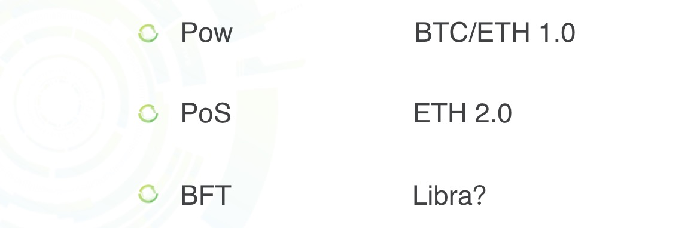

这3类共识分别又衍生出各种各样的共识：

1. POW、POW-DAG、NC-Max等
2. Pos、PoA、DPos等
3. PBFT、LibraBFT等

这些共识各有自己的特点，同时相互之间又可能存在一些关联。共识是一个很广阔的话题，感兴趣的可以自己去了解一下。由于BFT本身比较复杂，接下来我们深入讲述BFT，一步一步逼近我们的主题——LibraBFT。

## BFT如何达成共识

BFT比较复杂，概念也很多，因此，我们分成多步讲解，从简单的场景开始，逐步扩展：

1. BFT的安全性与活性
2. 能容忍的拜占庭节点数
4. 同步与异步
5. PBFT和两阶段确认
6. 三阶段确认的Hotstuff
6. 链式Hotstuff

### BFT的安全性与活性

很多讲BFT或者讲Paxos的文章都会讲拜占庭将军的故事，版本不一，核心思想差不多，这里我们引用百度百科：
拜占庭位于如今的土耳其的伊斯坦布尔，是东罗马帝国的首都。由于当时拜占庭罗马帝国国土辽阔，为了达到防御目的，每个军队都分隔很远，将军与将军之间只能靠信差传消息。 在战争的时候，拜占庭军队内所有将军和副官必须达成一致的共识，决定是否有赢的机会才去攻打敌人的阵营。但是，在军队内有可能存有叛徒和敌军的间谍，左右将军们的决定又扰乱整体军队的秩序。在进行共识时，结果并不代表大多数人的意见。这时候，在已知有成员谋反的情况下，其余忠诚的将军在不受叛徒的影响下如何达成一致的协议，拜占庭问题就此形成。

以上是百度百科摘取的拜占庭将军的故事，一句话总结，就是要让所有的忠诚将军行动一致，要么实力最强，要么战斗力最强。换句话说，忠诚将军一致行动的安全系数最高。如果出现部分忠诚的将军去进攻，部分忠诚的将军撤退的情况，那么后果不堪设想。

拜占庭容错BFT（Byzantine Fault Tolerance）就是为了解决这个问题。这里有两个很关键的指标：

1. 安全性：all correct nodes must agree on the same value，就是说所有的忠诚将军达成一致；
2. 活性：all nodes must eventually decide on an output value，可以理解为，投票一定会产生结果，也就是所有节点达成一致；

安全性是目的，活性是所有造成投票进行不下去的各种异常的一个整体概况。为了同时保证安全性和活性，很容易提出问题：

1. 在一个确定数量的集群里，最多能容忍的拜占庭节点是多少？
2. 在分布式的环境里，消息延迟了怎么办？

### 能容忍的拜占庭节点数

关于能容忍的最大拜占庭节点数，Lamport大神有数学推导，感兴趣的可以去看看，但是我看了一个更通俗易懂的推导版本。

我们来简化一下问题：假设有一个n个人的部门，准备春游，从A、B两个地方进行选择，哪个地方票数最多，就去哪。其中有f个人很宅，哪都不想去（不诚实节点）。而剩下的所有h个人都是想去旅行的（诚实节点）。这里，不管是诚实还是不诚实节点，都有可能不投票。那么可能会出现这样的结果，A和B的票数一样多，部门行政就不知道该怎么办了，卡住了。而不诚实节点恰恰就希望卡住，为此不诚实的节点可能视情况而投票：

1. 如果A和B的票一样多，那么不诚实节点就不投票
2. 如果A和B的票相差不多，那么不诚实节点会根据自身利益，不约而同选少的一方，最终让A和B的票一样多

总之，不诚实节点希望出现“得不出结论”的尴尬局面。为了避免出现这种“达不成共识”的情况，最多那个的选票最少要达到x，才能形成绝对优势而胜出。

回到拜占庭将军问题上，不管是进攻还是撤退，忠诚的将军只能收取大部分将军传过来的命令之后（注意，因为有叛徒的存在，所以只能是大部分，而不能等待收集全部命令，否则投票会卡住），统计出一个票数最多的命令，并且执行这个命令。为了让所有忠诚的将军的命令一致，胜出的命令最少应该达到x个，忠诚的将军才能放心大胆的执行这条命令，因为他知道这个命令达到了x个，其他忠诚的将军也是执行同样的命令。

拜占庭将军的例子要比上面部门旅游的例子更复杂一些：部门旅游的选票是给部门行政一个人统计，统一公布；而拜占庭将军的例子是所有将军给其他将军发消息，每个将军自己统计自己收到的消息。那么会存在这样的情况，叛徒将军给A将军发的进攻，给B将军发的撤退。所以做决策的时候，x>n/2+1是不够的，这种情况会有下面表达式3体现出来。

我们用将隐含的重要信息摘出来：

~~~
1. 总人数
2. 最少票数不应该比诚实节点数多，否则不诚实节点只要全部不投票，投票就将进行不下去
3. 如果一个结果要代表所有诚实节点，那么起码有一半以上的诚实节点投了这个结果
4. 对于不诚实节点，可能给不同的人的投票信息不一样
~~~

我们将这些信息转化成表达式：

~~~
1  => n = f + h
2  => h >= x
3+4=> x > h/2 + f
~~~

根据上面的3个不等式，进行推导

~~~
=> h > h/2 + f 
=> 1.5h > h + f 
=> 1.5h > n 
=> h > 2/3 * n => f < 1/3 * n
~~~

虽然上面的推导是围绕胜出的票数x，但是得出的结论是最多能容忍的拜占庭节点数f。也就是说，要达成共识，拜占庭节点数f必须小于总节点数的n/3，n=3f+1而且x=2f+1。为什么要算这个呢？因为后面会用到。同时，我们也知道了拜占庭节点可能的操作：

1. 不投票
2. 给不同的节点投不同的票

对于第2种操作，可以通过消息签名的方式避免。那只有拜占庭节点不投票或者leader不发起投票（leader本身是拜占庭节点）的情况了，这种情况被称为弱中止条件下的拜占庭将军问题。

### 同步与异步

前面我们提到了网络延迟的问题。对分布式系统来说，网络拥塞等异常情况，有可能导致网络延迟非常的大，甚至没有上限。根据协议对延迟依赖情况，将协议分成了3类：

1. 同步：网络延迟有上限且上限是已知的；
2. 异步：消息延迟没有上限；
3. 部分异步：网络延迟有上限但是上限是未知的；

同步模型适合对网络延迟特别敏感的场景；部分异步模型可以理解为覆盖了一般情况下的网络异常，比较接近日常的一般场景，最实用。

部分异步模型下，投票通常会由leader发起，由于leader可能是拜占庭节点，为了保证活性，会对多个节点进行排序，轮流当leader。一旦出现leader为拜占庭节点的情况，导致一定延迟内，不能达成一致，则换下一个leader维持投票过程。Libra实现的LibraBFT共识，使用了Hotstuff作为拜占庭容错算法，属于部分异步模型。

### PBFT和两阶段确认

BFT是围绕投票进行的，其中PBFT（实用拜占庭容错算法）最常见。

下面是PBFT算法的大概流程，我们先看一下每个阶段所代表的意思：

1. request：触发leader发起提案
2. pre-prepare：leader准备提案，并把提案广播给所有节点
3. prepare：节点要把自己的vote广播给其他节点，所以消息复杂度是O(N^2)，同时会对收到的所有vote进行统计
4. commit：当这个提案达到2f+1的vote时，节点会认为这个提案取得了认可，这时候，当前节点会通知所有其他节点他打算提交（commit）这个提案，commit消息不但要表明自己接收提案，还必须包含自己收集到的2f+1个vote。如果当前节点收到了2f+1个针对这个提案的commit，这时候才表示这个结果达成了一致。这个阶段比较复杂，下面会重点讲。

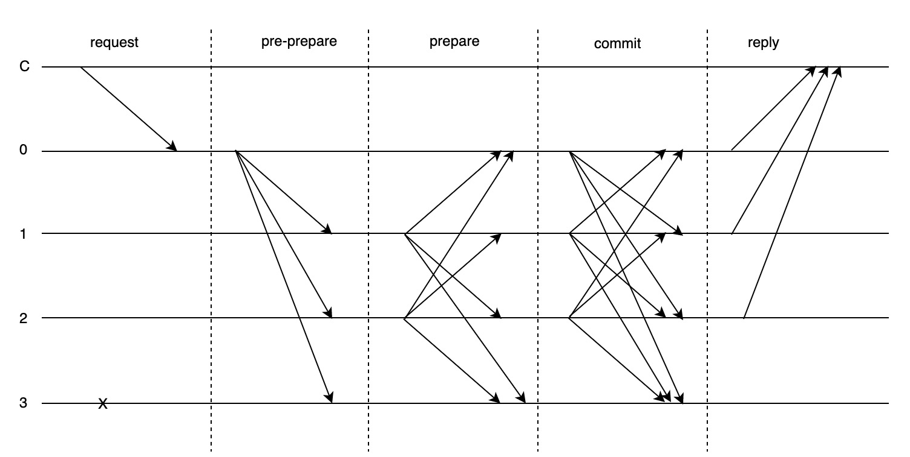

上面等于发起了两轮投票，为什么要进行两轮投票才能最终达成一致呢？

我们来设想一下只有一轮投票的场景：

正好有那么一个时刻，3节点给1节点发送了投票消息之后，成为了拜占庭节点。2节点虽然是非拜占庭节点，但是还没发起投票。这时候，1节点收到了3票，分别是0、1、3，所以1节点有理由觉得所有诚实节点达成了共识。但实际上并没有达成一致，这时候2节点可能会由于超时，发起要求重新投票的请求，并且0和3有可能同意这个请求。所以，只有一轮投票有可能没有达成一致。

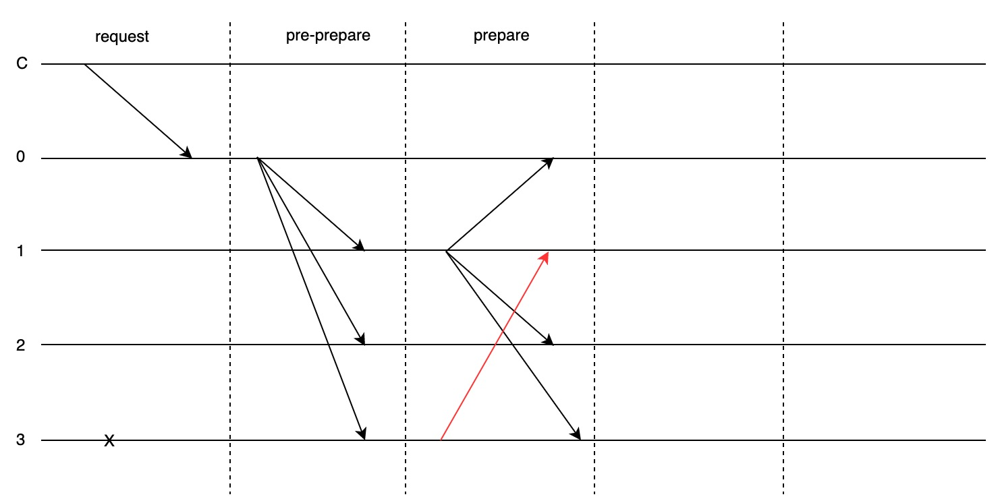

为了解决上面的问题，所以PBFT协议设计中又进行了一轮投票，解决第一轮投票不能达成一致的情况，这就是commit阶段。但是细想一下，第二轮投票也会出现达不成一致的情况：

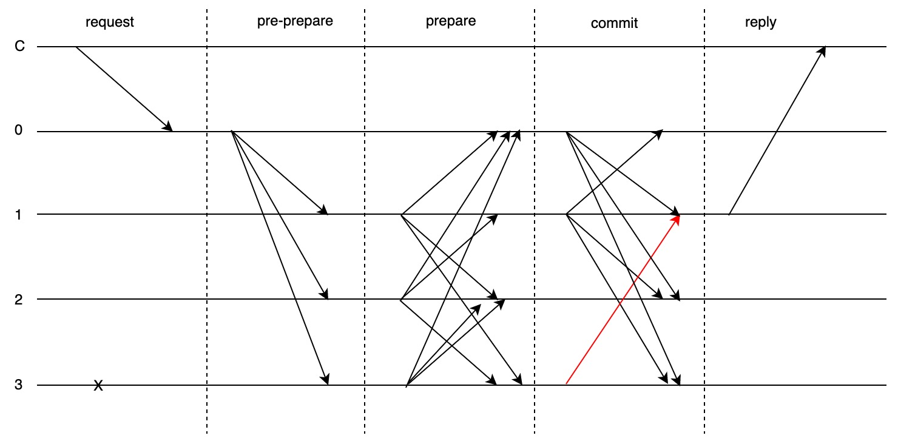

虽然解决了第一轮投票的问题，但是好像第二轮投票又出现了第一轮同样的问题？实际上PBFT对第二轮投票进行了优化：

所有节点在发送确认消息（commit）的时候，不但要告诉其他节点自己的状态，还需要带上证明，也就是需要带上其他节点发给自己的2f+1个vote的签名消息（这是O(N^3)的消息复杂度）。

在区块链的应用场景里，后一个块是基于前一个块的。如果以BFT作为共识，那么出块顺序是确定的，后面出块的节点不仅要构建新的区块，还需要在提案中给出前一个区块的证明，要么2f+1签名的commit，要么2f+1的超时签名（这也是O(N^3)的消息复杂度），否则，该出块节点就是拜占庭节点，将发起超时投票给下一个出块节点。

以上是对PBFT以及两阶段确认的一个大概讲述。非拜占庭节点通过两轮投票达成共识，通过多leader和超时等机制保证了协议的活性，但是，需要O(N^3)的消息复杂度。

### 三阶段确认的Hotstuff

PBFT是一个非常经典的拜占庭容错算法。在两阶段确认的commit阶段，由于要带上其他节点签名的vote消息以证明自己的状态不是说谎来的，这导致了O(N^3)的消息复杂度，因此也有明显的瓶颈。有没有算法能解决这个问题呢？Libra的LibraBFT共识协议选用的 [Hotstuff](1) 拜占庭容错算法通过“门限签名+三阶段确认”很巧妙的解决了这个问题。

Hotstuff的第一作者是康奈尔大学的在读博士生尹茂帆老师。对比前面的两阶段确认，我们看到，Hotstuff在prepare和commit中间多了一个pre-commit阶段，为什么多一轮投票就能解决消息复杂度的问题呢？

首先，我们简单的说明一下门限签名的作用，感兴趣的可以自己去研究一下。n个节点通过某种方式给每个节点生成了一个私钥，但是只有一个公共的公钥。接下来，所有的投票信息都由属于自己的这把私钥进行(k,n)签名。同一条消息，只有集齐了k个节点的签名，才能构造出一个能通过公共的公钥验证成功的总签名。这样的话，节点的提案要想达成共识，必须收集2f+1个节点对同一条”同意该提案“的消息的签名，才能构造出一个能使用公共的公钥验证成功的总签名，否则就进入了超时流程。

接下来，我们看一下使用了门限签名之后，三阶段确认大概的过程。我们来重点看一下由leader发起的4条消息：

①prepare阶段：leader将包含自己的”提案+前一个commitQC“的消息msg1广播给所有节点

②pre-commit阶段：leader收到了2f+1个节点”通过msg1提案“的签名消息，然后使用这些签名构造一个”prepareQC总签名“的消息msg2，并将msg2广播给所有节点，让他们对自己构造的prepareQC进行验证

③commit阶段：leader收到了2f+1个节点”msg2的prepareQC验证通过“的签名消息，然后使用这些签名又构造成一个”pre-commitQC总签名+提交提案“的消息msg3，并广播给所有节点pre-commitQC进行验证

④decide阶段：leader收到了2f+1个节点”msg3的pre-commitQC验证通过“的签名消息，这个时候等于leader收到共识达成一致的证明，然后使用这些签名正式构造一个commitQC总签名的消息msg4，广播给所有节点

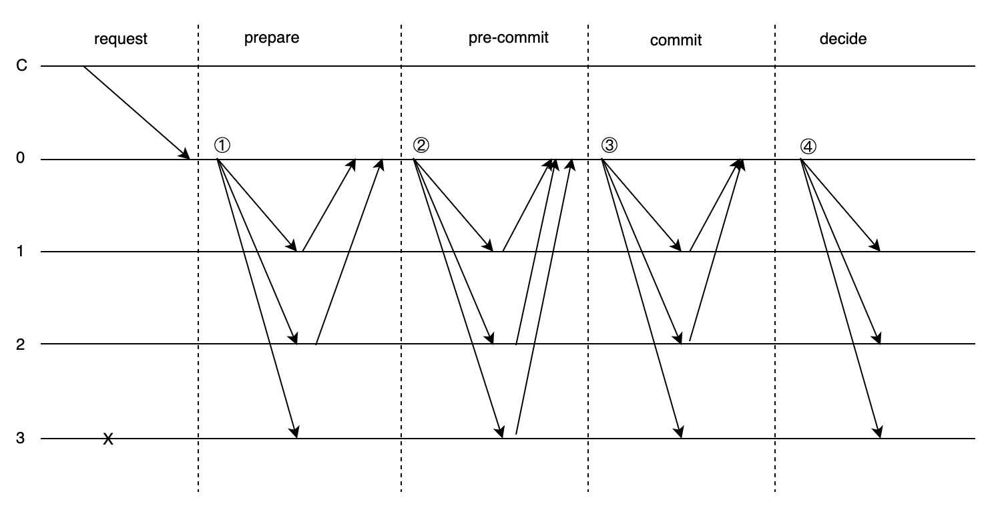

以上是三阶段确认的大概过程，有点绕口，从图可以看出，与两阶段对比，主要有两点不同：

1. 三阶段确认比两阶段确认多了一个pre-commit阶段。实际上三阶段确认的pre-commit阶段+commit阶段，就等于两阶段确认的commit阶段。换句话说，两阶段确认的commit阶段里包含了2f+1个节点的vote用于证明自己没有说谎，这个证明在三阶段确认中被独立拿出来进行了一轮投票，就是上图中的pre-commit阶段。这是两阶段确认模型与三阶段确认模型的主要区别，这么理解，上面的过程就不饶了。

2. 所有节点只跟leader打交道：三阶段确认巧妙的通过门限签名，将本应该是所有节点都要收集的消息，优化成”leader统一收集，其他节点只需要对总签名进行校验“的过程，将消息复杂度降到了O(N)。当然，超时机制差不多，需要收集2f+1的超时签名构造一个总签名，替换掉commitQC。

以上就是我认为的三阶段确认与两阶段确认最主要的区别，其中QC（quorum certificate）是法定节点数证书，可以理解为总的签名。

### 链式Hotstuff

前面我们讲述了三阶段确认其实是Basic HotStuff，在区块链的应用场景下，整个过程概括起来大概是这样的：

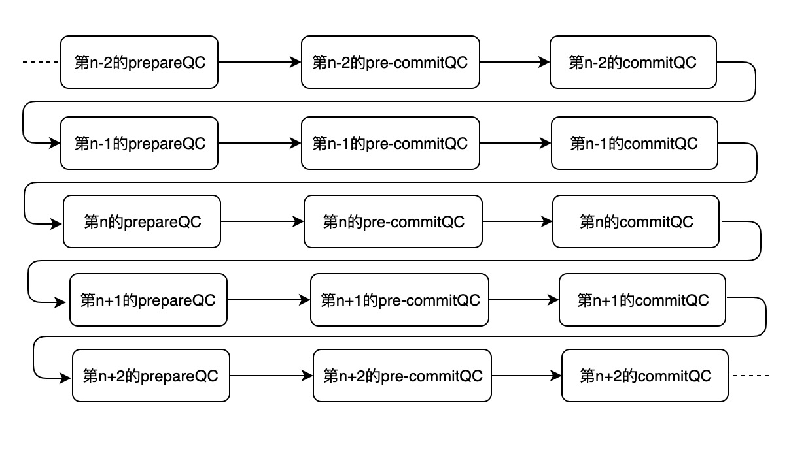

总的来说就是”prepareQC->pre-commitQC->commitQC“这3个门限签名的QC不断的转换，hotstuff作者们在三阶段确认的基础上，又对算法做了进一步优化，这就是Chained HotStuff：

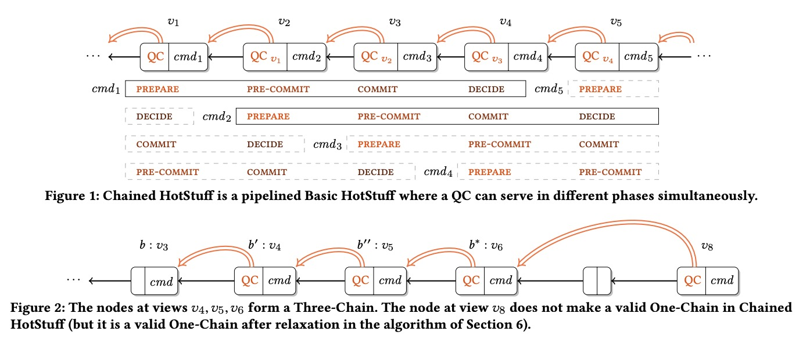

投票轮次和网络消息都得到了很好的优化，将原本需要进行3轮的投票，合并到1轮了。最终的结果就成了这样：

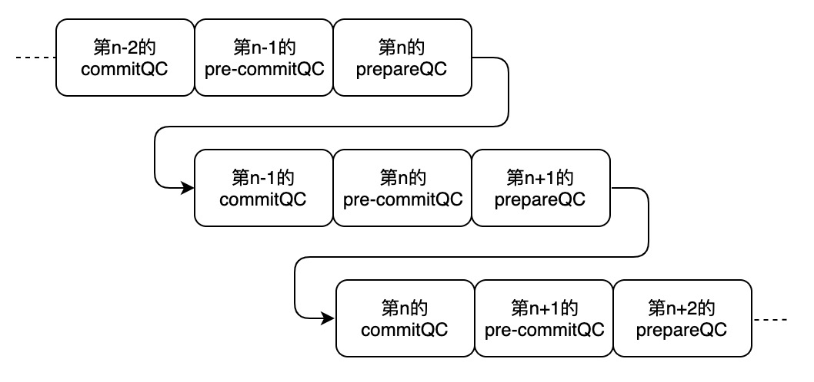

以上就是链式hotstuff设计巧妙的地方。

## Libra的consensus组件

前面我们深入介绍了BFT的背景知识，包括拜占庭将军的故事、拜占庭容错算法最多能容忍的拜占庭节点数、部分同步模型；接着，我们详细讲述了两阶段确认的拜占庭容错算法；最后，我们讲述了巧妙的结合了门限签名和三阶段确认的Hotstuff，以及进一步优化后的链式Hotstuff。

LibraBFT共识是基于Hotstuff实现的，我们先看一下Libra的Block结构：

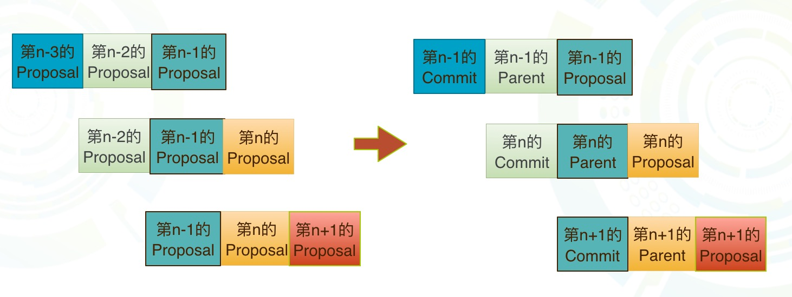

是不是跟链式Hotstuff很像？Libra在每一轮投票中，既会校验当前Proposal的Block，同时也会对爷爷Block达成共识。这样，爷爷Block就会被commit，并把Block包含的Transaction以及涉及的用户状态存储到DB中。

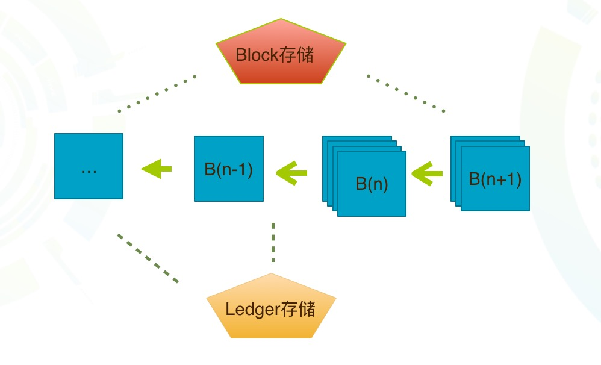

所以Libra的Ledger存储看上去总是比Block存储低两个高度，因为后来两个高度的Block还没有达成共识，分别处于pre-commitQC阶段和prepareQC阶段。Libra实现的共识流程大概是这样的：

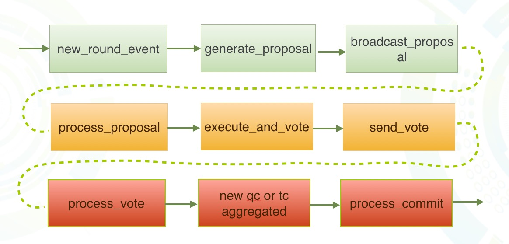

上图有两个需要注意的地方：

1. round代表了一轮投票，round的event由Pacemaker（起搏器）维护，Pacemaker组件主要负责算法活性，维护超时时间；
2. 绿色表示当前round的leader，负责生成Block并发起proposal；黄色表示其他Validator节点，负责验证和投票；红色表示下一个round的leader，负责收集统计投票、处理commit，然后在下一个round构造Block、发起proposal；

这里有几个关键的问题，在流程中没有体现出来：

- 如何确定proposer
- 如何更新一组proposer

下面我们来逐个讨论。

### 如何确定proposer

Libra的实现中有3种proposer策略：FixedProposer、MultipleOrderedProposers、RotatingProposer。
1. FixedProposer：表示指定固定节点当Proposer，一般用于测试；
2. RotatingProposer：表示一批节点轮流当Proposer，每个round返回一个Proposer；
3. MultipleOrderedProposers：复杂一些，见下图，其中还使用了随机数VRF算法（感兴趣的可以去研究一下），保障每个round所有节点得到一组相同顺序的Proposer，但是每个round之间的Proposer顺序不同；

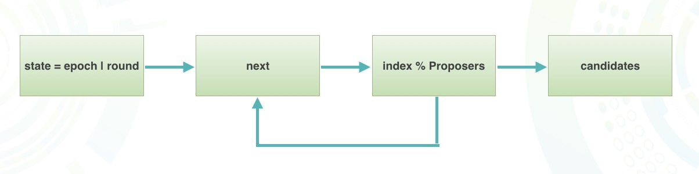

所以在使用MultipleOrderedProposers的情况下，每轮投票都有一组Proposer，Proposer存在优先级，非拜占庭节点会根据Proposer的优先级，给优先级最高的Proposer投票。这样减少了Proposer为拜占庭节点的风险，如果一组Proposer均为拜占庭节点，那么Validator投超时的票TC。

### 如何更新一组proposer

前面我们讲述了Proposer大概的确定过程，多个round的Proposer组虽然顺序不同，但是一直是相同的几个Proposer在不停的变换顺序。那如果要换掉这些Proposer呢？尤其是需要在这么多节点之间要同一时间对同一结果达成共识。

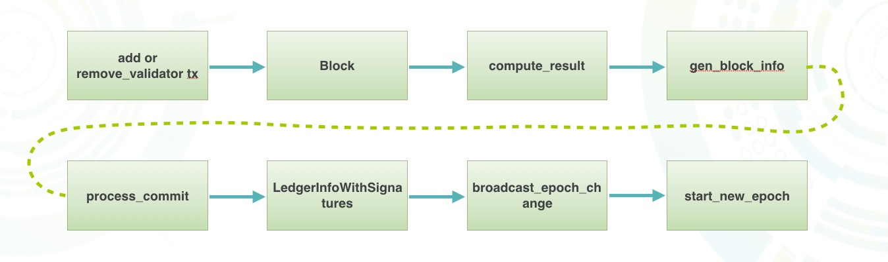

实际上，更新Proposer组需要通过transaction调用add_validator或者remove_validator的合约（合约被存储在一个特殊的账号下），transaction在打包的时候会被执行，如果存在validator更新，会把更新放到Block的block_info中，同时也会把transaction打包进Block。最后，随着这个Block被commit，所有的Validator会根据block_info的信息更新本地的proposer组。这样，所有的节点在同一个round把proposer组更新了，整个过程在libra中叫Reconfiguration。

## 总结

在Libra的第3条主线中，概念和内容比较多，我们先后介绍了这些内容：

1. 为了保证所有账号的数据正确，所以需要在全球范围对transaction的顺序快速达成共识；
2. 当下主流的共识协议，例如Pow、Pos、BFT等；
3. Libra使用了Hotstuff算法，属于BFT的一种，因此我们了解了很多跟BFT相关的背景知识，主要包括两阶段确认、三阶段确认以及链式Hotstuff；
4. 最后，我们了解了Libra的consensus组件，包括投票流程、确定proposer的流程、Reconfiguration流程等等，基本上覆盖了LIbraBFT共识协议的主要过程。

[1]: https://tedyin.com/archive/hotstuff-podc2019.pdf