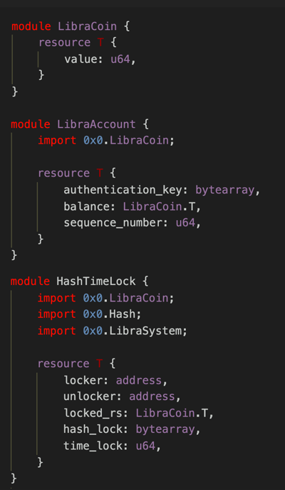
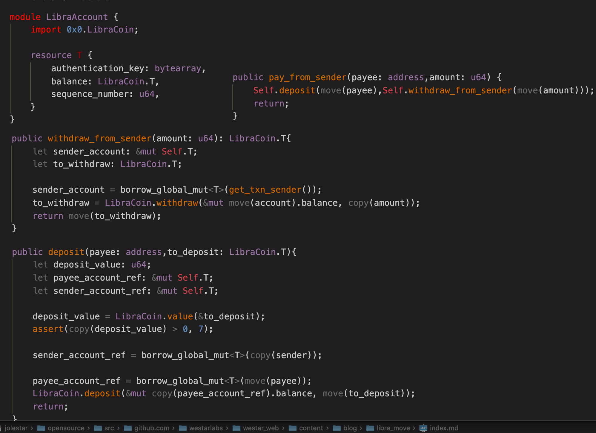
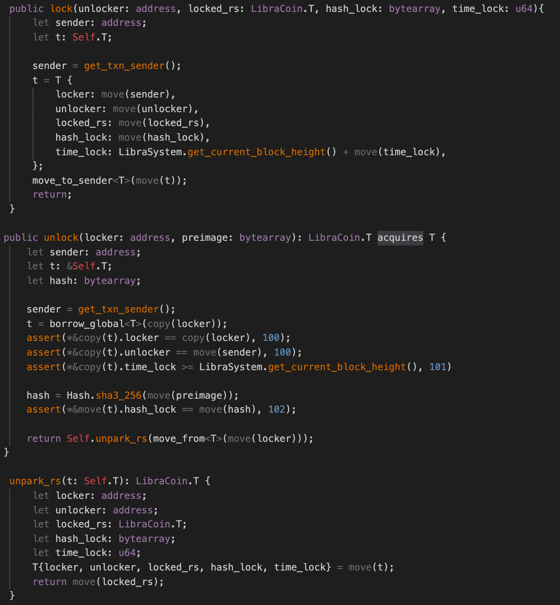
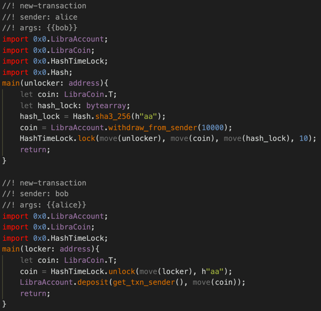
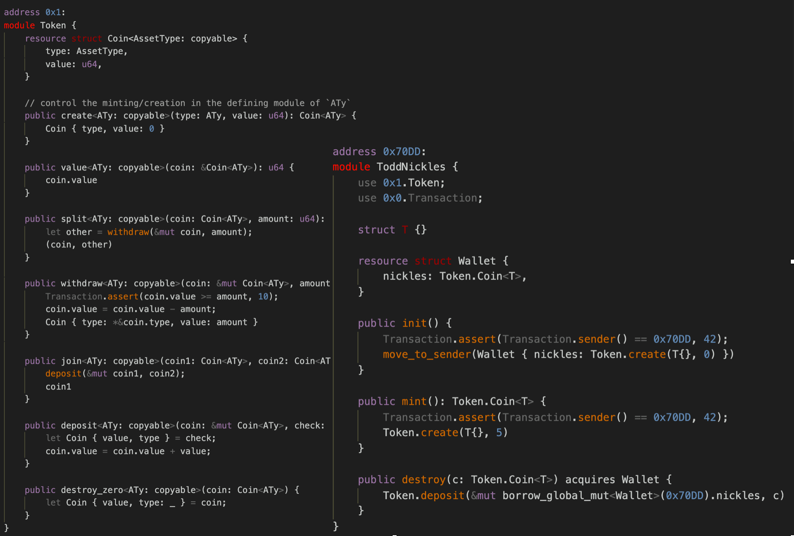
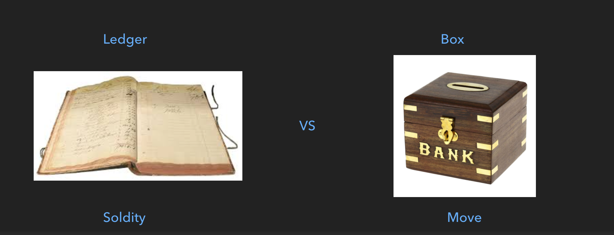

智能合约是区块链领域大家一直比较关注的主题，本文试图从智能合约的演进角度分析 Libra 的 Move 合约要解决的问题，以及其架构设计，也就是回答『 Libra 为什么要重新设计一种编程语言？』这个问题。

## 智能合约是什么

开始这个题目之前，我们可以先讨论一个比较大一点的话题，到底什么是『智能合约』？其实『智能合约』这个词在业界争议也很大，每个人有每个人的看法。我们为了方便讨论，在当前主题背景下给它做一个限定。

* 运行在链上的，由用户自定义的程序
* 通过链节点的重复校验以及共识机制，使其具有不依赖于权威方的独立约束力

首先它是运行在链上，由用户自定义的程序。如果是在链上直接实现的，哪怕是通过插件的机制，我们这里也不把它叫做智能合约。其次，因为有了链的重复校验以及共识能力，让这种程序具有了约束力。这个约束力不来自于你对某一方的信任，即便是合约的开发者，也要受这套约束机制的约束。

至于关于『智能合约』的争议点这里不深入讨论，感兴趣的朋友可以看我以前的一篇从『法律合约』角度讨论智能合约的文章 -《[智能合约到底是什么？](https://jolestar.com/what-is-the-smart-contract/)》。

## 回顾智能合约的演进

为了理解 Libra 的 Move，我们简单回顾一下智能合约的演进过程。毕竟发明一种新的编程语言需要有足够的动机，世界上的编程语言这么多了，为什么又要发明一种新的语言？这种新的语言要解决什么问题？所以我们得从演进的角度看这个问题。对 Bitcoin 和 Ethereum 都非常熟悉的朋友可以直接跳到后面部分。

### Bitcoin 的智能合约

（图片来源：Mastering Bitcoin 2nd）

Bitcoin 的智能合约就是给资产上锁和解锁的脚本（Locking & Unlocking Script）。简单的理解就是 Bitcoin 提供了一种智能锁，用户可以根据自己的需求，排列组合，形成自己的锁，用来锁定或者解锁资产。

那它为什么不直接确定一种锁定和解锁方式，而是弄很脚本让用户自定义呢？主要目的是给链提供一种逻辑扩展性，这样用户可以在不改变链的基础代码的情况下，增加一些功能，做一些实验。同时它是无状态的（Stateless），一把锁只管一份资产，锁与锁之间也不能共享数据。也被设计成图灵不完备的（Turing Incompleteness），避免用户写出太复杂的锁增加链的解锁校验成本。

因为 Bitcoin 自己定义的应用场景很明确，无论把它理解成密码货币或者密码资产，主要功能就是保存资产，转让资产。这样的设计也满足它的场景需求了。**只要资产转让合约可以通过锁和解锁来表达，那就可以用 Bitcoin 的智能合约实现。** 但是不是所有的合约都可以通过锁和解锁表达出来？这个还有待证明。设计一套锁和解锁的协议是非常有挑战性的，比如闪电网络的协议。  关于 Bitcoin 上的不同的锁的机制可以参看李画和我的一个访谈文章 -《[开启比特币智能合约的「三把锁」](https://jolestar.com/bitcoin-smart-contract/)》。

但既然 Bitcoin 提供了这样一种去中心化记账的能力，用户会想我是否可以把它用在其他地方？比如把一份数据的 Hash 作为一个地址，给这个地址转很小一笔资产，这个 Hash 地址就被公示在链上了，就可以提供一种数据的存在证明。但这笔钱是没办法被花费的，因为没有人知道这个 Hash 地址对应的私钥是什么。如果这样的交易多了后，会给 Bitcoin 的链带来很大的压力，因为链要维护所有的未花费交易（UTXO）。

于是 Bitcoin 开发者就想了一个办法，增加了一个指令 OP_RETURN。用户不需要把自己的数据伪装成地址，直接在脚本中嵌入自己的数据，然后再加上 OP_RETURN，这样链就知道这笔交易在未来不会被花费，仅仅是记录数据在区块中。而有了这套机制后，越来越多的第三方开发者就尝试用 Bitcoin 的网络来发行另外一种资产，这就是大家常说的染色币（Colored Coins）。染色币利用了 Bitcoin 网络的广播交易，在区块中记录数据的能力，发行方只需要运行一些节点接入 Bitcoin 网络，对 OP_RETURN 中的数据进行校验即可，成本比自己独立运行一条链的成本低许多。那再进一步想下，如果脚本中能读取和生成状态，是不是这种校验节点也可以不需要了，可以直接委托给链来校验了？这就诞生了 Ethereum。

### Ethereum 的智能合约

Ethereum 的智能合约是有状态的，图灵完备的。比如看一下社区官网给的一个 Coin 的例子（有简化）：

这个例子中，Coin 合约中的 balances 是一个 map，保存用户的地址和余额的映射，转账时减少发送方的余额，增加接收方的余额就行。看起来很简单吧？像是一个单机程序一样，会一点编程语言的人大约就能看明白。但要提供这样的能力，有一些难题需需要解决，而 Ethereum 的这些解决方案都是区块链智能合约领域很重要的创新。

**图灵完备与停机问题**

既然是图灵完备的语言，那就需要解决停机问题。如果有人写一个死循环合约放到链上，那所有的节点都进入了死循环。并且根据停机问题的证明，没办法直接通过分析程序来判断是否会进入死循环，也就是说没办法提前阻止用户部署这样的合约到链上，只有真正运行的时候才知道是否会死循环。于是 Ethereum 设计了一种 gas 机制，执行每个指令的时候都需要消耗一部分 gas，当 gas 消耗完了后合约会执行失败退出。这是一个非常经典的创新。

**合约的状态存储与节点状态的一致性校验**

Bitcoin 中的脚本是无状态的，它的状态只是 UTXO，每个节点维护一份自己的 UTXO 列表就行。但 Ethereum 的合约是有状态的（就是合约中保存的数据，比如前面例子中每个人的余额），并且可以通过交易变更，那如果这些状态出现了不一致的情况（比如有 bug 或者存储设备错误），节点如何校验？

为了解决这个问题，Ethereum 设计了一种状态树：

(图片来源:[ethereum stackexchange ethereum-block-architecture](https://ethereum.stackexchange.com/questions/268/ethereum-block-architecture))

它整体的思路是每个合约中的每个外部存储变量，在状态树上都表现为一个节点。一个合约的所有变量生成一个状态树，数的根节点就是 Storage Root，而这个 Storage Root 又通过合约地址映射到 Global Storage Root 上。只要任何一个合约中的任何一个变量有变化，Global Storage Root 就会变化，节点之间就可以通过比较 Global Storage Root 来快速校验数据的一致性。同时它也提供了一种状态证明能力，可以让节点之间信任对方的状态数据，快速同步节点状态，而不是重新通过区块计算一遍。 

关于这个状态树（Merkle Patricia Tree），这里也不细说，有兴趣的可以看看 Ethereum 相关的书或者文章。

**合约的抽象与跨合约调用**

既然是 Ethereum 提供的 Solidity 是一种完备的编程语言，就有抽象与互相调用的问题。Solidity 中设计了 Interface，这个和其他编程语言中的 Interface 类似。开发者可以先协商定义一种 Interface 作为标准，然后各自实现。合约之间，以及合约和客户端（比如钱包）之间都可以通过 Interface 来调用。

例如上面的 ERC20 的 interface，定义了转账，查询余额等标准方法。而 approve 的目的是给第三方授权一个额度，可以从用户账号上扣钱，类似于信用卡的预授权机制。社区开发者如果有新的想法了就提出一个 ERCxxx，其他人可以基于这个 ERCxxx 进行进一步的组合创新。这套机制灵活性很强，Ethereum 上繁荣的 Defi 生态主要就是依赖这套机制演进出来的。

### Ethereum 的问题

当然，世上没有完美的技术，Ethereum 提供了一些新的能力，同时也带来一些新的问题。

**链上原生资产（Ether）和通过合约定义的资产（ERC 20 Token）之间的抽象和行为不一致**

这点如果写过 Ethereum 合约的人就会很有体会。如果你要写一个合约，同时处理 Ether 和其他 Token，你会发现二者的处理逻辑完全不一样，很难用统一的方式去处理。并且二者的安全性也不一样，Ether 的安全性由链保证，而 Token 的安全依赖于该 Token 的开发者。比如 Ethereum 中的 layer2 方案里，如果同时要支持 Ether 和 Token 也会比较复杂。

**安全问题**

Ethereum 上爆出了很多安全性事故，虽然很多问题的直接原因是合约开发者的实现不够严谨，但本质上的原因来自于两点：

* 可扩展性与确定性之间的矛盾

Interface 的机制提供了很强大的扩展性，但 Interface 只定义了接口，并无法保证实现遵循接口的要求。比如下面这个例子，是我曾经开发的一个恶搞的 Token:

这个 Token 的转账方法里面包含一种随机机制，有一定的概率可以转让成功，但也有一定的概率反倒增加自己的 Token。而这种行为被 Interface 的 transfer 掩盖，调用方根本不清楚它的具体实现，从而可能带来安全性问题。

当然有一种办法是直接实现一种确定逻辑的 Token，不允许用户自定义逻辑，只提供有限的配置项，比如总额，名称等。有的链为了解决 Ethereum 的安全性问题，就是这样做的。但这样用户就无法根据自己的场景进行扩展，比如要实现一个只对某个群体的用户可用的 Token。同时这种扩展性需求是没法穷举的，只能让用户不断尝试演化。这就是可扩展性与确定性之间的矛盾难题。

* 合约间的调用问题

Ethereum 上的合约间的调用，是一种动态调用。它实际上构造了一种内部的交易，然后启动了一个新的虚拟机去执行调用。机制上有点像服务器之间的远程调用，而这种调用有可能形成循环调用，从而出现类似并发的情况，即便虚拟机是单线程执行的。比如 A 合约调用 B 合约，而 B 合约又调回 A 合约。于是 A 合约的前一次执行尚未完成，又进行了下一次执行，而第二次的执行无法读取到第一次执行的中间状态。这也就是那次 DAO attack 利用的漏洞。关于这个问题的分析可以参看论文 [A Concurrent Perspective on Smart Contracts](https://arxiv.org/pdf/1702.05511.pdf)。

* 合约状态爆炸

合约状态爆炸的主要原因是 Ethereum 虽然设计了 gas 费用机制，避免用户滥用网络。但这个 gas 只针对计算，是一次性收取的，一旦数据写入到合约状态，就永久保留了，用户无需为自己的数据未来的存储承担成本。这样导致用户和开发者都没有动力去清理无用的状态。同时，Ethereum 的同一个合约的所有用户状态都在该合约账号下，热门合约下的数据会膨胀的更厉害。

Ethereum 开发者尝试实现状态租赁的机制，让用户为自己的状态付 state fees，但所有用户的状态都是保存在合约账号下的，链很难明确状态和用户的关系，更无法区分那些是合约的公共状态，哪些是具体用户的状态，方案设计起来非常复杂，最后还是放弃了，将这个目标放在了 Ethereum 2.0 中。感兴趣的读者可以看看 [Ethereum state fees](https://github.com/ledgerwatch/eth_state/blob/master/State_Fees_3.pdf) 的一版方案设计。

思考一下，上面 Ethereum 遗留的几个问题，如果让你来设计方案，你会如何解决？后面我们来具体分析 Libra 的 Move 是如何解决这些问题的。

## Libra Move

这是我总结的 Move 的几个特点：

- First-class Resources
- Abstract by data not behavior，No interface，No dynamic dispatch。
- Use Data visibility & Limited mutability to protected resource，No inheritance.

First-class Resources 包含两层的含义。一层就是大家常说的一等公民资产。Libra 上，所有的资产都是通过合约实现的，包括 LibraCoin，都共享一套抽象逻辑以及安全机制，地位平等。第二层意思是 Move 中的资产都是通过 Resource 定义的一种类型，可以直接在数据结构中引用。

第二条简单的理解就是它抛弃了 interface 的机制。但如果没有了 interface，我们怎么定义协议和标准呢？具体它是怎么通过数据来抽象的，这个后面细说。

第三条是说，既然资产是一种数据类型，并不能隐藏到合约内部，通过什么方式保护它？比如阻止用户直接 new 出某种资产？

在了解 Move 如何解决上面的问题之前，我们先了解一下 Move 中的基本概念。

### Move 中的基本概念

**Module，Resource\|Struct，Function**

Module 和其他语言中的模块，比如 Rust 中的 mod，Ethereum Solidity 中的 Contract 类似，封装了一系列数据结构以及方法。Resource|Struct 和其他语言中的 Struct 一样，都是用来定义新的数据结构类型。Resourc 和 |Struct 的区别是 Resource 要存储到外部状态中，并且是不可复制的。Function 和其他语言中的 Function 没有太大区别。

**Copy，Move**

这是 Move 借鉴 Rust 的生命周期机制引入的概念，Move 中的所有变量使用的时候都需要确定是要 Move 还是 Copy，一旦被 Move，该变量就不可再被使用。而 Resource 只能被 Move 不能被 Copy，当然 Resource 的引用（Reference）是可以 Copy 的。这样编译器就可以向追踪内存的使用一样，追踪资产的转移和变化，避免资产凭空消失或者产生。

**Builtin 方法**

Move 提供了一些内置的方法来和链的状态交互。Solidity 中，开发者几乎不需要关心合约的状态是怎么存储和持久化的，几乎对开发者透明。但 Libra 中，开发者要显式的调用方法去外部获取状态。这样强迫开发者在写合约的时候，把状态明确拆分到了具体的账号下，才能实现状态租赁以及淘汰机制。

- borrow_global<T>(address)/borrow_global_mut<T>(address)  从 address 账号下获取类型为 T 的 Resource 引用。 
- move_from<T>(address)  将 Resource T 从 address 账号下 move 出来。
- move_to_sender<T>() 将 Resource T 存到交易的发送方账号下。

上面例子中的 T 都必须是当前 Module 定义的类型，一个 Module 中不能直接获取其他 Module 定义的类型。下面我们通过一些具体的例子来理解 Move 的机制。

### 一个的例子

这个例子是 LibraCoin 的定义：

比如上图的 LibraCoin module，定义了一种 resource 类型 T，代表一种 Coin，内部只包含一个数字，代表它的值。而在 LibraAccount 以及 HashTimeLock 中，直接引用 LibraCoin.T 作为自己类型的一个字段。从这里就可以看出 Move 和 Solidity 之间的差异。Solidity 中，一种 Coin 就是一个合约，并不存在某种 Coin 的数据类型。那这样定义后，Coin 如何定义自己的行为呢？用户怎么用呢？继续看下面的例子。

LibraCoin module 中定义了 LibraCoin.T 的最基本的方法，比如获取它的 value，切分，合并等。这些方法都是和 Coin 类型相关的最基本的操作，并不包含更高级的，比如给某个账号转账。LibraCoin 中的 deposit 和 withdraw 方法，并不是针对账号，而是正对 LibraCoin.T 类型的引用。在 Move 中，某个 Resource 的内部结构只有定义该 Resource 的 module 内可见，外部 module 只能将某个 Resource 当一个整体对待，无法直接行 split，join 这样的操作。

那合约中定义的 Coin 如何发行呢？既然它是一种类型，如何控制  Coin 发行的权限？

上面的例子中有一个 mint 方法，进行铸币，方法最后实际上就是直接 new 了一个 LibraCoin.T，并填入一个 数字。而这个方法有一个参数，capability，它代表一种铸币的权限。而 MintCapability 如何产生呢？可以看 initialize 方法，这个是在创世块初始化的时候，由一个特殊账号创建，并持有。只要账号下拥有 MintCapability ，即可通过 mint_with_default_capability 方法来铸币。

继续来看看如何 LibraCoin 如何实现高级的转账:

LibraAccount 的 T 中的 balance 字段是 LibraCoin.T  类型的，所以针对账号的转账，支付都是在 LibraAccount 中定义的，LibraAccount 调用 LibraCoin 的方法操作自己的 balance 字段，从而实现转账。LibraCoin 本身不关心高级的转账逻辑。这样一层一层组合起来，就构造出高级的功能了。

继续看一下 HashTimeLock 的一种实现：

例子中的 lock 方法，将资产封装到 HashTimeLock.T 中，并和 hash ，time 绑定在一起。unlock 的时候校验 hash 以及 time，如果正确则将 HashTimeLock.T 解开，返回其中封装的资产。而 lock 的时候的资产从哪里来，解锁后的资产又存到哪里去，这个 HashTimeLock 合约不关心，可以由其他合约定义，或者直接在交易的 main 脚本中编写，如：

这个脚本中，资产是从 LibraAccount 中取出，之后又充到 LibraAccount 中。这个可以由每个交易自己定义。

### 不支持 Interface 如何定义标准

前面的例子可以看出 Move 如何通过组装以及可见性机制来组合出高级功能，在不提供动态分发的机制下，也保证了足够的扩展。但如果没有 Interface 这样的机制，如何定义像 Ethereum 中的 ERC20 这样的标准？不同的 Token 的实现都不一样，上层的 Defi 协议如何定义？

有一次我和 Move 的开发者交流这个问题，他说了一句话给我印象很深刻。

> When code is law, interfaces are a crime. -- tnowacki 

在代码即法律的世界，接口就是犯罪。因为接口只定义了行为，却不关心实现。而对资产进行编码的时候，用户更希望资产本身相关的操作是确定的。

他举了一个 Token 的例子：

这个例子通过泛型定义了一种带标签的 Coin，任何人都可以基于这个 Coin 来定义一种新的 Coin。Coin 的基本操作都是确定的，但 Coin 的发行者可以在上层继续封装，衍生出不一样的特性。这样的机制下，既保证了行为的确定性，也具有足够的扩展性。

打一个比喻，Solidity 中的 Token 实现类似于记录了一个账本，而 Move 则类似于把资产封装起来。大家去租东西交押金的时候，会遇到两种营业员。第一种把营业员把钱汇总到一起，然后在账本上记录一下。第二种营业员则把钱用一个夹子夹起来，记个名字。第一种退钱的时候，营业员需要修改账本，然后把押金从汇总的钱中分出来，给客户。而后一种则直接找到对应的押金夹子直接给客户。前一种像 Solidity ，后一种像 Move。箱子的好处是可以箱子套箱子，很容易组合出更复杂的箱子，账本要组合就只能通过账本之间互相引用记录来实现。

### Move 的状态存储

前面介绍了一下 Move 语言本身的特性，而合约的编程语言和它的状态存储机制密不可分，下面我们再探讨一下 Libra 在状态存储机制上的改进。

上面这个公式说明了哪些数据属于 Libra 的 GlobalState。所有账号和账号状态之间的映射。而账号的状态包括用户部署的合约（Module），以及用户通过合约生成的 Resource。这点上和 Ethereum 的关键区别是每个用户的所有状态都在其的账号路径下，而不是散落在各个合约里。 

  (图片来源 libra 白皮书)

上图中的， Sparse Merkle Tree 相当于 Ethereum 中的 Merkle Patricia Tree，二者作用一样，只是算法实现上有差异。而 Merkle Tree Accumulator 则是 Libra 新增加的。Ethereum 中，每个区块生成一个全局状态树的根，打包在区块头里。而 Libra 中的做法是每个交易都生成一个状态树的根，然后把这些根和交易信息关联，再用累加器累加起来，生成一个累加器的根，区块的头中包含累加器的根就可以了。这个累加器是全局的，并不是某个区块的。

可以先看看它的累加器（Accumulator）的实现：

累加器顾名思义其实就是把数据累加起来形成一个结果，但还要能提供这个结果包含某个数据的证明。累加器也有纯密码学的实现（如 RSA Accumulator），但计算效率还很难达到应用的要求，安全证明也比较难，所以通过 Merkle tree 来实现累加器是一种更现实的做法。

Merkle tree 来实现累加器其实就是要提供一种给 Merkle tree 动态增加节点的算法。Merkle tree 本身是一种二叉树，如果叶子节点是确定的，树的高度也就是确定的，计算根节点的值比较容易。但累加器的叶子节点要动态增长的，树的高度也是动态增长的。如上图所示，左边的两颗子树是已经 frozen 的，它的叶节点的值对后面的计算已经没用了，只需要 frozen 的根节点参与计算即可。整个树逐渐增长，逐渐从左到右 frozen。这种算法业界讨论的也挺早了，比如 Bitcion 社区讨论的 Merkle Mountain Ranges 算法。由于篇幅所限，这里不仔细分析它的算法。这种全局累加器的最大作用是提供全局的交易执行存在证明。Ethereum 和 Bitcion 上要证明一个交易发生过，只能先证明改交易被打包在某个区块了，再证明该区块确实在链上，而有了全局累加器可以提供直接的证明。

再来看看它的 Sparse Merkle tree 实现。

(图片来源 libra 白皮书)

Ethereum 用 Merkle Tree 来存状态，提供状态证明，遇到的第一个问题就是 Merkle Tree 的高度太高，计算和存储成本高，生成的证明也很大。于是它做了一个优化，相当于把二叉树给变成十六叉树了。而 Libra 的思路类似，也是给路径做压缩。比如上图中的 1 是一棵完整的二叉树，2 优化掉了空的子树，3 在不产生分歧的情况下，优化掉了中间的节点，缩短了路径。可以说和 Ethereum 的 Merkle Patricia Tree 殊途同归，但 Sparse Merkle tree 的一个独特优点是可以提供不存在证明。更详细的算法实现分析可以看 @lerencao 的文章 [Jellyfish Merkle Tree in Libra Blockchain](http://westar.io/blog/jellyfish-merkle-tree-in-libra/) 。

 ### Move 的现状

最后简单说一下 Move 的现状。

* 上面的部分例子是 Move IR（中间语言），部分是  Move source lang。Move source lang 是对最终开发者的编程语言，但现在还没正式用在 Libra 中，Libra 中用的还是 IR。
* 泛型的支持尚未最终完成，上面的部分例子还不能直接运行。
* Account 状态现在整个是打包成一个大的二进制，尚未像 Ethereum 那样拆分成两层的 tree。
* 集合类型支持上不完备，比如 Map 的支持等。
* 空间租赁机制只是理论上设计，尚未实现。

## 总结

总结一下 Move 和 Libra 的主要改进点以及意义：

* FirstClass Resource，让资产不仅可编程，并且可以映射成程序中的类型，提供了一种新的编程的模型。
* 同一个用户的所有状态都在用户路径下。这个让对状态空间租赁以及用户状态淘汰提供了技术上的可能。（注:用户状态被淘汰后，可以通过付费再重新存回来）。

- 状态存储机制上的改进与优化，给一个交易都关联一个全局状态，可以提供交易的全局证明。

Libra 的这些设计在二层（layer2）机制也很有潜力，主要来源于 1 它统一的资产编程模型，比较容易设计通用的 layer2 方案。2 用户状态的拆分，方便状态在链上链下之间迁移。3. 全局的证明机制，方便二层仲裁。具体如何利用这些特性设计 layer2 方案，我会在未来的文章中和大家探讨。

最后回答一下开篇的问题，上面这些创新点确实足够支撑 Move 作为一种新的编程语言立足。技术的发展就是在不断引入通过创新来解决遗留问题，但同时又带来新的问题，然后再触发新的创新这样一波一波推进的。