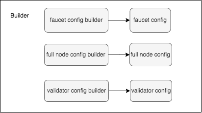
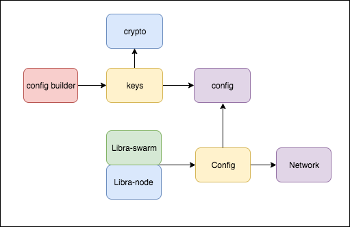
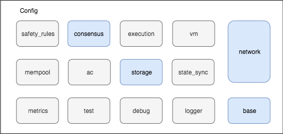
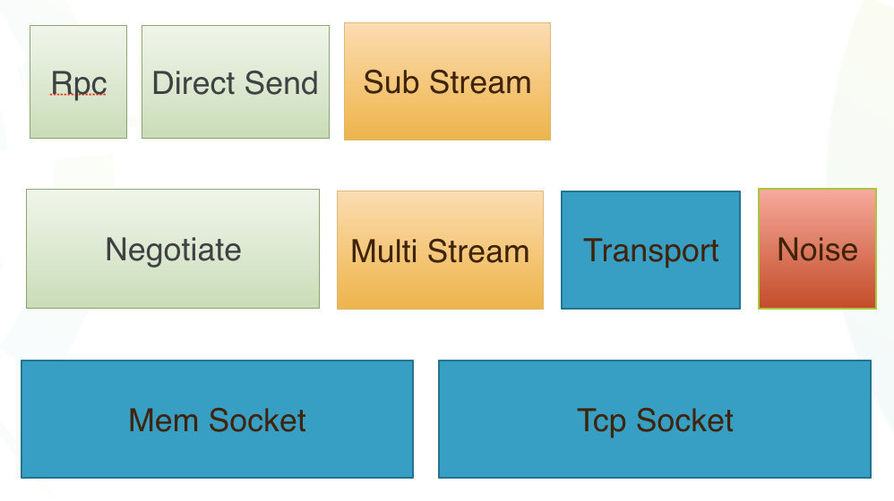
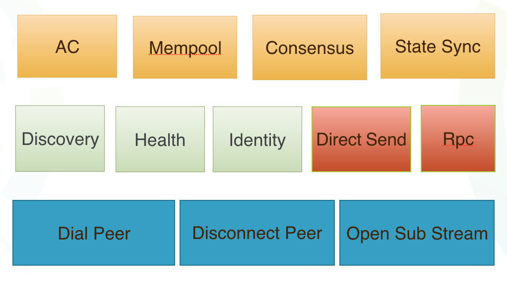
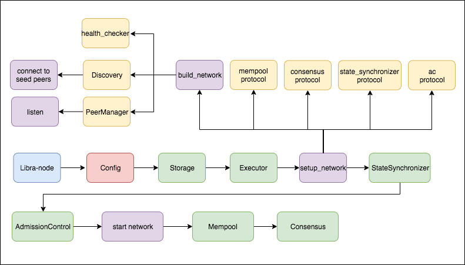

6 月 18 日，Facebook 发布了 Libra 白皮书及源码，引起了业界的广泛关注与讨论。

这里我们通过分析Libra的源码，探索Libra的各个组件，来了解一下Libra的整体设计与实现。

### Libra核心组件

在进入主题之前，我们先对Libra有一个整体的认识：

看过Libra技术白皮书的朋友，应该都记得这张图，下面简单介绍一下这些核心的组件（后面还会有更详细的讨论）：

​	a. AdmissionControl服务：简称AC，翻译过来叫准入控制，可以理解为Libra的网关，将跟用户打交道的接口暴露给用户，例如提交Transaction、获取用户状态等等

​	b. Mempool服务：存储未上链交易

​	c. Consensus组件：LibraBFT共识组件

​	d. VirtualMachine组件：简称VM，运行Move合约的虚拟机

​	e. Execution组件：VM的入口，已换成Executor组件

​	f. Storage服务：存储所有链上数据

​	g. Network组件：上图中隐含了一个Network组件，不论是Node启动还是跟其他节点通信，都需要Network组件。在第一条主线中，我们重点介绍Network组件。

注意，上面介绍各个核心组件的时候，我们区分了组件和服务，两者的区别是：组件没有额外监听端口，与node共用同一个端口，而服务会单独监听一个端口，通常是GRPC服务。

### Libra设计与实现

Libra涉及的东西比较多，我们从三条线介绍Libra的设计与实现：

1. 通过分析Node启动并加入到Libra网络的过程，介绍[Network组件的设计与实现](http://westar.io/blog/libra_network/)；
2. 围绕[Transaction的生命周期](http://westar.io/blog/libra_tx/)，分析其接收交易、打包区块、运行上链的过程，介绍Libra的Mempool、Executor以及Storage、VM等核心组件；
3. 围绕LibraBFT，介绍[Consensus组件](http://westar.io/blog/libra_consensus/)以及区块达成共识的过程

如果想了解或者使用Libra，我们需要先启动一个节点，并将它加入到网络中。接下来，我们看看第一条主线，了解一下Node的启动以及Network的设计与实现。

### Node启动流程

我们先看一下Node大概的启动流程，主要包含两部分：

1. 生成config

   Libra的Config的模块中，能构建3种类型的配置文件，分别是validator、faucet、fullnode的配置文件。其中faucet配置是水龙头服务相关的一些配置，通常只有测试网络中第一个validator节点才需要。

   

2. 启动node

上图中Libra-node用于启动单节点，Libra-swarm用于批量启动多节点。接下来，我们分别看一下这两步的一些实现细节，以及之前的准备工作。

### 准备工作

在一切继续之前，我们先准备需要依赖的环境

​	1). 获取Libra代码

​	git clone https://github.com/libra/libra.git

​	2). 编译和运行环境

​		a. 建议使用Libra自带的脚本script/dev_setup.sh安装环境依赖

​		b. 或者自己手动安装rust、cargo、git、pb、go、CMake等工具

​	

### 生成config

​	从前面的Node启动流程我们了解到，启动node首先需要生成配置。Libra包含的配置文件比较多，我们来整体看一下配置文件：

​	不过没有特殊需求的话，需要我们特别注意和关注的配置其实也不算多（见上图蓝色部分），主要有：

​		a. Node的角色分为Validator和FullNode

​		b. 生成3个秘钥，2个ed25519算法生成，分别用于打包block签名、网络的消息签名，Libra提供了一个generate_keypair工具生成ed25519秘钥(cargo run -p generate_keypair -- -o mint.key)，1个是x25519算法生成，用于标识节点身份

​		c. 数据存储路径，默认会生成临时路径

​		d. network_peers：存放网络中Node的公钥等信息，主要包含网络消息签名的公钥和节点身份的公钥

​		e. seed_peers：当前节点加入网络主动去连接的node的信息

​		f. consensus_peers：所有Validator节点的信息，Libra网络是一个许可形网络

​		g. 各服务的端口以及其他配置，没有特殊要求的话，默认就好

### 启动Node

1. 连接Libra的测试网络

   sh scripts/cli/start_cli_testnet.sh

2. 自建节点

   cargo run -p libra-node 
   
   或者
   
   cargo run -p libra-swarm -- -s

当前node启动起来之后，会根据seed_peers的配置，去连接相应的node节点，加入到网络中去，如果没有seed_peers则会启动一个单独的网络。接下来，我们深入了解一下Node的Network的一些设计与核心实现。

### Network

##### 1. Network核心模块

我们整体看一下Network包含哪些模块：

上面中，从下往上看：

​	a. MemSocket实现了UNIX domain socket的功能，一般用于测试

​	b. TcpSocket网络连接

​	c. Transport可以理解为MemSocket和TcpSocket的一层抽象，封装了socket的操作

​	d. Noise是一种加密协议，前面提到的用于网络消息签名的ed25519私钥，就是作用在这里

​	e. Rpc是Libra自己实现的远程过程调用协议，调用方会等待被调用方返回结果

​	f.  DirectSend从字面理解是直接发送，调用方发送完立即返回，不等待被调用方返回结果

​	g. Negotiate可以理解为对Rpc和DirectSend的抽象

​	h. MultiStream用于多路复用，使用了yamux协议。通俗的理解就是在同一个Tcp连接上，从逻辑上将每种上层协议封装成一个单独SubStream，以实现多个上层协议共用一个Tcp连接的情况。这一点后面我们还会提到。

以上是Libra的Network组件的一个整体实现，接下来我们介绍一下Libra的协议。

##### 2. Libra的主要协议

上面我们对Network组件有了一个宏观的认识，这里我们介绍一下Libra包含的协议：

上图中，从下往上看：

​	a. PeerManager封装了网络连接以及多路复用的操作

​	b. Identity协议：前面提到的x25519私钥，就是Identity协议用于标识当前节点的身份，协议会根据节点的Role将Validator网络与Fullnode网络进行隔离

​	c. Health协议：定期随机选择一个节点发送探活消息

​	d. Discovery协议：每个round从相邻的节点同步节点信息，以发现新节点，可以理解为gossip协议

​	e. AdmissionControl协议：只有RPC的实现，Fullnode节点在收到用户提交的Transaction之后，通过AC协议将Transaction转发给Validator节点

​	f. Mempool协议：只有DirectSend实现，用于不同的Mempool之间同步Transaction

​	g. Consensus协议：包含RPC和DirectSend，用于Validator之间达成共识

​	h. StateSynchronizer协议：只有DirectSend实现，不同node之间寻找Block

前面我们提到了多路复用，上面的协议都是通过MultiStream分别开了SubStream，逻辑上把消息协议区分出来。其中Identity、Health、Discovery是所有node都会包含的基本协议，而Consensus是只有Validator节点才会包含的协议。

### 总结

   最开始我们讲了Node启动流程，讲述了config配置需要注意的地方以及node启动的方式和流程。然后我们深入到Network组件，讲了Network的组成模块以及提供的协议能力。我们以单节点为例，将整个启动以及加入网络的过程总结如下图：

其中黄色部分表示在Network的端口是开启了SubStream，添加了相应的协议和协议处理过程；绿色部分部分表示服务或者组件实例化，可以看出Storage和Executor不依赖Network；初始化Discovery协议的时候，节点会去连接seed节点，并且seed节点会验证Identity。以上是节点启动以及加入到网络的大概流程。