Libra涉及的东西比较多，我们从三条线介绍Libra的设计与实现：

1. 通过分析Node启动并加入到Libra网络的过程，介绍[Network组件的设计与实现](http://westar.io/blog/libra_network/)；
2. 围绕[Transaction的生命周期](http://westar.io/blog/libra_tx/)，分析其接收交易、打包区块、运行上链的过程，介绍Libra的Mempool、Executor以及Storage、VM等核心组件；
3. 围绕LibraBFT，介绍[Consensus组件](http://westar.io/blog/libra_consensus/)以及区块达成共识的过程

前面我们讲述了Libra的第一条主线——Node启动以及加入网络的过程，详细介绍了Network组件的设计与实现。这里，我们将要讲述Libra的第二条主线——Transaction的生命周期，再围绕Transaction的生命周期，逐个讲述Libra各个核心组件的一些设计与实现。在讲述生命周期之前，我们先了解一下账号模型以及Transaction与Move合约的关系。

### 账号模型

实际上区块链可以简单的理解为：使用Transaction为载体，按大部分人认可的顺序记录每个Address的变更过程。为了达到这个目的，区块链发展至今抽象出两种账号模型：以BTC为代表的UTXO模型和以ETH为代表的Account模型。这两种模型各有优劣，简单对比一下：

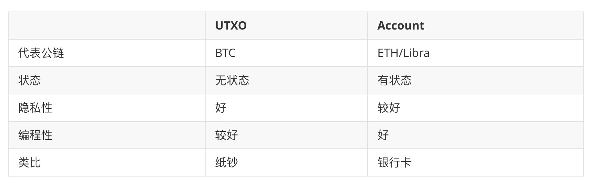

UTXO的英文是Unspent Transaction Output，直译就是未消费的交易输出，一个Address的当前状态就是一个UTXO列表。UTXO模型下，消费(构造Transaction)的时候拿出一个或者多个UTXO当作当前Transaction的Input，然后生成多个UTXO，Input和Output的总额是相等的。在未来的某个时刻，这些Output又被当做其他Transaction的Input。是不是跟纸钞有些像？而Account模型中，每个Address通常包含一个的总额和SequenceNumber计数器。每次消费(构造Transaction)的时候会从当前Address的总额中减去消费额，在另一个Address中加上相应的消费额，同时通过SequenceNumber递增的方式，保证当前Address构造的出来的所有Transaction有先后顺序，从而保障账号的状态正确。

Libra使用的Account模型来表达账本数据，所以Transaction有严格的先后顺序。这点在后面我们还会提到。

### Transaction与Move合约

前面我们了解了账号模型，为了便于理解，以支付的场景做了类比。给我们的感觉就是，Transaction的作用就是对一个数字进行加减运算，例如Alice给Bob转了一笔账。那就不能应用于更多、更复杂的场景吗？比如游戏。区块链起步的时候，表达能力相对比较简单，随着区块链的推广，大家的需求越来越丰富，最初的设计难以满足。我们希望能通过一门语言，在链上表达我们的需求，所以虚拟机、智能合约以及合约语言顺势产生了。这是一个很广阔的话题。Libra推出了Move语言作为合约语言，这里我们不展开讲。那么Transaction、链、Move到底是什么关系呢？

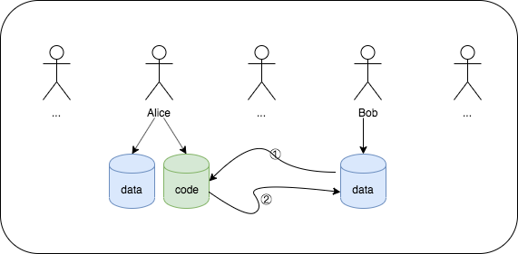

我们假设上图是某个时刻，链上所存储的账号数据，其中Alice有一个Move定义的合约，code被存储在她的账号下。上图的第①步中，Bob构建一个Transaction，在Transaction中指定运行Alice账号下对应的合约的一个方法，并从自己的账号下取出该合约方法能理解的数据作为方法的参数，然后对Transaction进行签名并广播出去。图中第②步，矿工收到Bob的Transaction，打包到Block中，然后执行Bob的Transaction，并且将结果写到Bob的账号下面。整个过程中，大概的理解就是，Move定义了一段逻辑，Transaction设置了运行逻辑用到的数据，链记录了逻辑运行之后的最终状态。

### Transaction的生命周期

前面我们讲了两个背景知识，接下来，我们对Transaction的生命周期做一个整体的认识：

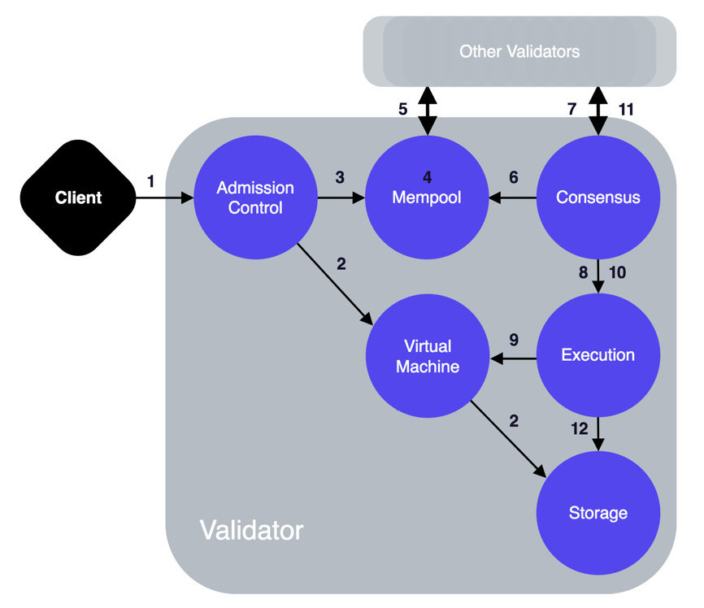

这张图也是Libra的技术白皮书中的一张图，跟前面介绍Libra核心组件那张图有些像，但是箭头上多了一些数字。这张图实际上是表示一个Transaction从生成到打包，从执行到上链的完整的生命周期。下面我们依次介绍一下每个数字大概代表的意思:

	1. 交易被用户使用wallet或者cli提交到AdmissionControl
 	2. AdmissionControl运行VM做一些Transaction的前置校验，例如交易的签名校验等等，过滤掉一些无效交易
 	3. Transaction前置校验通过后，会被提交到Mempool中
 	4. Transaction被设置为Ready状态，等待被打包进Block中
 	5. Transaction被设置为Ready状态之后，会被广播给其他Mempool
 	6. Validator节点的Consensus组件pull对应的Mempool组件，获取一批Ready状态的Transaction，用于创建Block
 	7. 新创建的Block被广播给其他Validator节点，并且选举Block
 	8. 拿到新的Block之后，提交到Executor组件执行Block
 	9. 新Block中的所有交易被提交给VirtualMachine组件，VM按顺序执行Block的所有交易
 	10. 提交被共识选举胜出的Block
 	11. 广播被共识选举胜出的Block
 	12. 存储胜出的Block中所有被KEEP的Transaction以及每个address对应的最终状态

我们对Transaction的生命周期有了一个直观的认识，接下来，我们深入每一个组件内部，了解更多的设计和实现细节。

### AC服务

从交易被用户提交开始，首先到AC服务。

在讲述第一条主线的时候，我们提到了AC是一个GRPC服务，相当于是Node的一个网关。Node包含多个GRPC服务和很多的RPC接口，然而只有跟用户打交道的两类接口，才有必要暴露出去给wallet或者cli调用：

1. 提交Transaction的接口
2. 用户状态相关的接口

所以AC没有太多的逻辑，只是对Node内部部分GRPC接口的一个封装，以暴露给用户使用。另外AC还有一个作用是对提交过来的Transaction做简单的过滤。

### Mempool服务

交易通过AC被提交到了Mempool服务。

在讲述第一条主线的时候，我们知道Mempool是用来存储未上链的Transaction。我们先来看一看Mempool的整体设计：

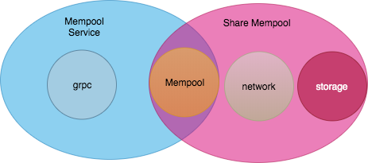

Mempool主要包含两个模块：

1. Mempool Service：是一个Grpc服务，用来接收从AC提交过来的Transaction
2. Share Mempool：主要有两个作用，一个是通过Mempool协议(在第一条主线的时候有提到)在不同的Mempool节点之间同步Transaction，另外是存储和处理Transaction

我们对Mempool有了一个整体的认识，但是还有些疑问，Mempool究竟对Transaction做了什么处理呢？什么情况下Transaction会被打包？Transaction又是什么时候被广播给其他Mempool？接下来我们就解答一下这些疑问。

##### Mempool内的Transaction状态转化

Transaction提交到Mempool之后，首先会根据来源将其标记为不同的状态：

1. Unready：用户主动提交到Mempool Service的交易状态
2. NonQualified：其他节点同步过来的交易状态

这些Transaction会按一定的顺序排序，等待被标记成Ready状态。前面我们提到了Libra采用Account模型，通过SequenceNumber将用户发起的Transaction按顺序关联起来，当Mempool发现某个Transaction前面的所有其他Transaction都被上链了或者都是Ready状态了，那么这个Transaction就可以被标记为Ready状态了，也就意味着这个Transaction具备打包进区块的条件了。如果当前被设置成Ready状态的Transaction是从Unready状态转变过来的(也就是用户通过AC提交到当前Mempool)，那么该Transaction会被转发给其他的Mempool。

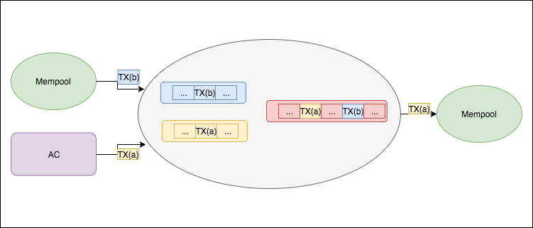

上图是Transaction在Mempool中大致的状态转化过程，而Transaction大概的排序规则是：gas_price>expiration_time>address>sequence_number

### Consensus组件

前面介绍了Mempool的状态转化，用户提交的Transaction处于Ready状态，等待被打包到区块中。考虑到Consensus的复杂性，以及当前主线主要是介绍Transaction的生命周期，这里只简单的介绍一下上链流程（多节点达成共识的过程将在第3条主线中详细介绍），大概如下：

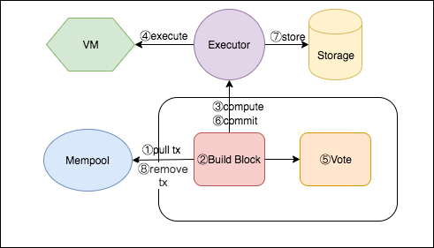

其中compute->execute以及commit->store会在后面讲，vote将在第3条主线详细讲，这里暂时只需要注意两个地方：

1. Consensus组件主动去Mempool中pull一批Ready状态的Transaction，并打包到Block
2. Block被选举并提交之后，Consensus组件会主动去删除Mempool中被提交的Transaction

### Executor&VM组件

由于Executor只是运行VM的一个入口，这里把Executor和VM合并到一起介绍。前面Consensus组件的流程中，Block被Build之后会被提交到Executor中comput，再进入VM中execute，这就是执行Transaction。也就是compute->execute过程，有些细节需要注意：

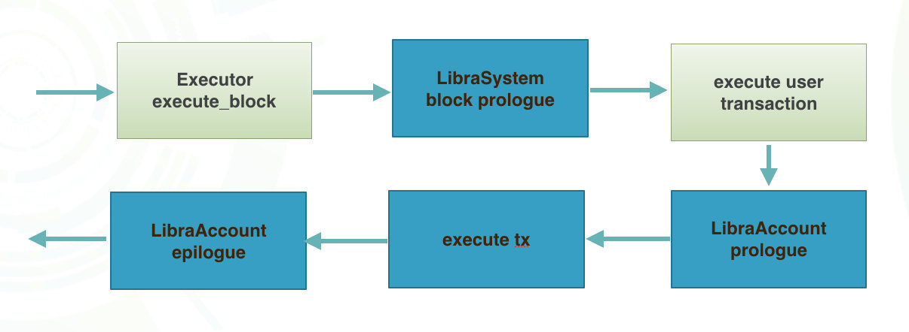

其中浅颜色由Executor发起，深颜色是在VM中执行的Move合约。Consensus组件将新的Block提交到Executor组件之后，Executor会为Block提供运行环境，初始化VM，依次在VM中运行Block的Coinbase和其他用户Transaction。所以VM会最先执行Coinbase交易，也就运行LibraAccount合约中的block prologue。然后再按顺序依次执行Block中打包的Transaction，最后将执行之后的状态返回给Consensus组件。

### Storage服务

在介绍Consensus组件的时候，我们提到了Block会被commit，数据最终会被写入Storage服务。也就是commit->store流程，这时候用户提交的Transaction已经被大家认可。关于Storage服务，我们可能会有两个疑问：

1. Storage服务包含哪些模块？
2. Storage最终存储了哪些数据？

##### Storage模块

Storage是一个GRPC服务，存储了所有链上的数据，用户的账本状态等信息就是从Storage获取的。Libra选择了RocksDB作为底层存储的数据库，SchemaDB基于RocksDB封装了对数据统一的CRUD操作以及Key-Value的系列化与反序列化方式。LibraDB是围绕Libra的账本数据和特点，定义了一系列数据结构，并针对这些数据结构进行数据库的操作。将所有的这些操作，封装成Storage服务，提供给Executor、AC等组件使用。

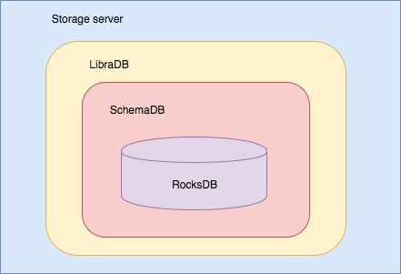

##### 账本数据

前面讲述Storage服务包含的模块，我们了解到LibraDB围绕Libra账本的特点定义了一些数据结构，Libra账本有什么特点？那么包含哪些核心数据结构呢？

1. 账本特点

   Libra采用Account，需要存储全局的用户状态，当前状态的所有历史交易以及交易的顺序。也就是说，Storage需要存储的主要数据：用户状态、交易及交易顺序。跟其他公链不同的是，一般的公链通过记录Block顺序(Block内的交易也是有序的)，来达到记录所有交易和交易的顺序的目的。而Libra直接存储交易，采用Merkle Accumulator来记录交易的顺序。

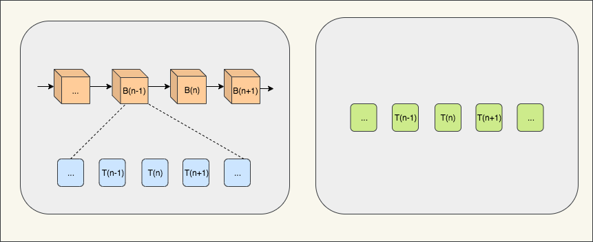

1. 核心数据结构

   Libra为了存储用户状态、交易及交易顺序，分别使用了Sparse Merkle Tree和Merkle Accumulator。

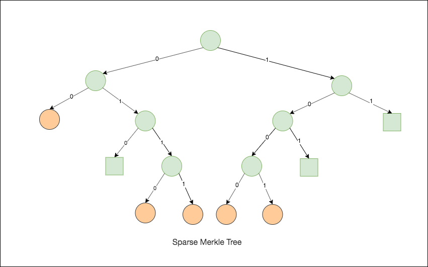

​	SparseMerkleTree使用256比特存储用户状态，理论上总共可以有2的256次方个账号。上图是4比特SparseMerkleTree的例子，每个橙色的叶子节点代表了一个用户；正方形的方块是占位符，表明该分支下没有账号，减少账号的存储；

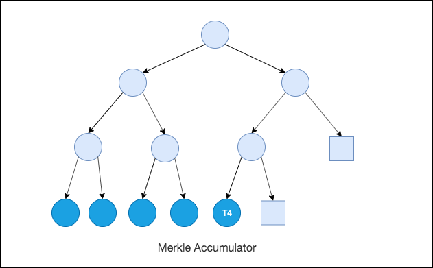

​	MerkleAccumulator存储交易以及交易的顺序。上图中，每个深颜色的叶子节点表示一个Transaction；正方形的方块是占位符。新上链的交易会按顺序一个一个被加入到后面。

​	上面提到了Storage的两个核心数据结构，整个Storage都在围绕他们进行存储和优化，更多细节不再展开。

### 总结

​	以上是Transaction整个生命周期的过程，依次经过AC、Mempool、Consensus、Executor、VM的处理，最终存储到Storage。然后我们深入到每一个组件或者服务，既介绍了他们的一些设计和实现，也了解了Transaction被处理的核心细节。
