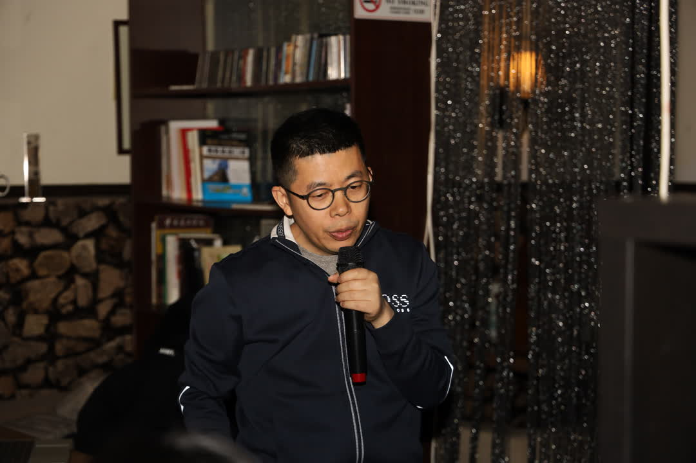
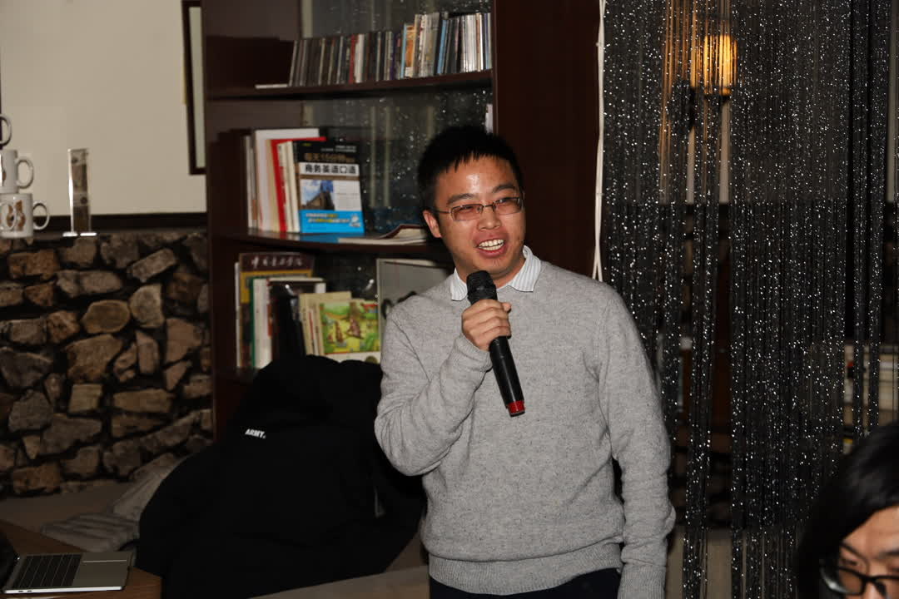
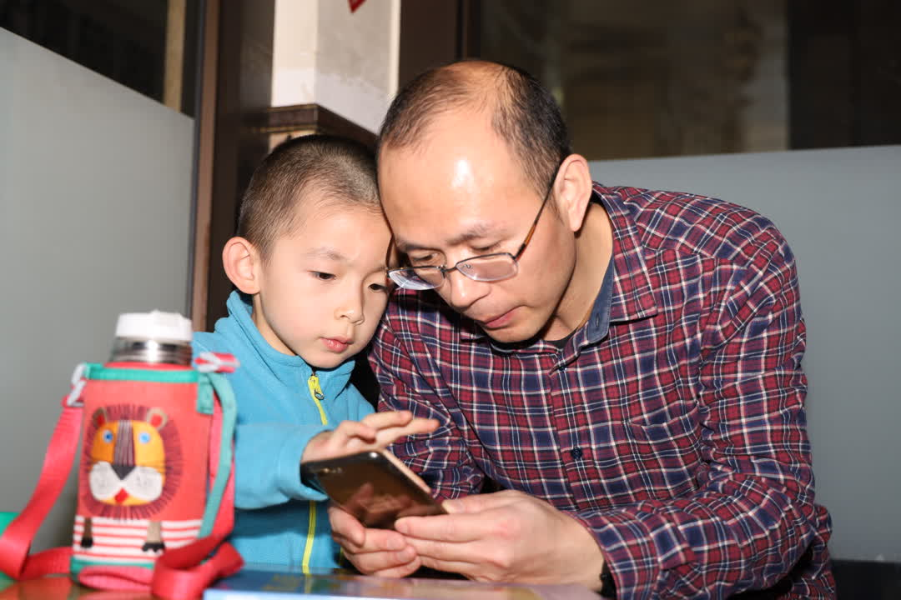
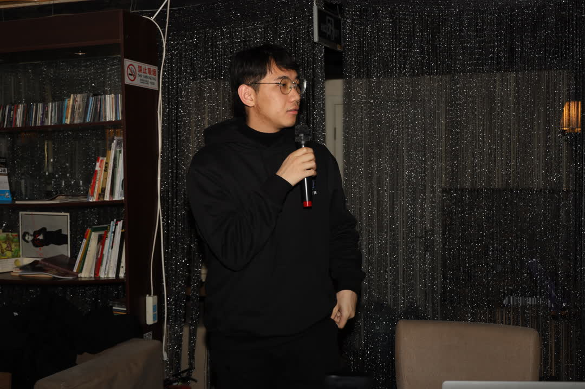
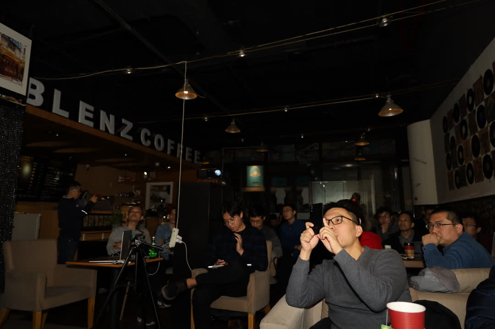
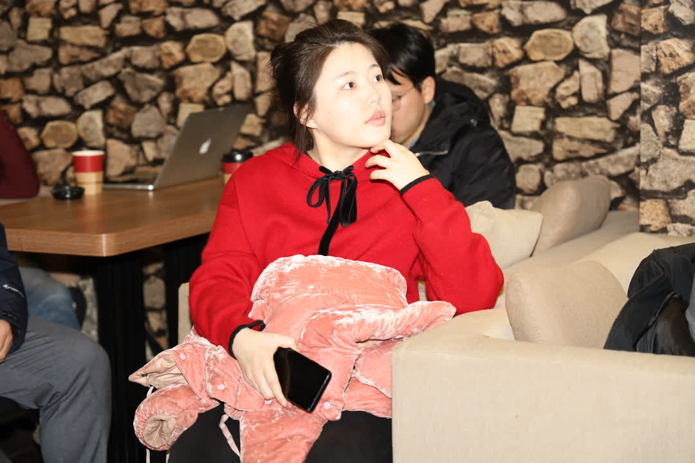
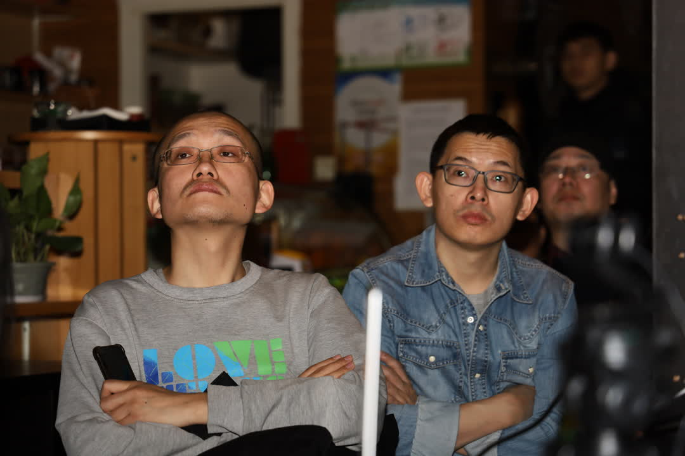
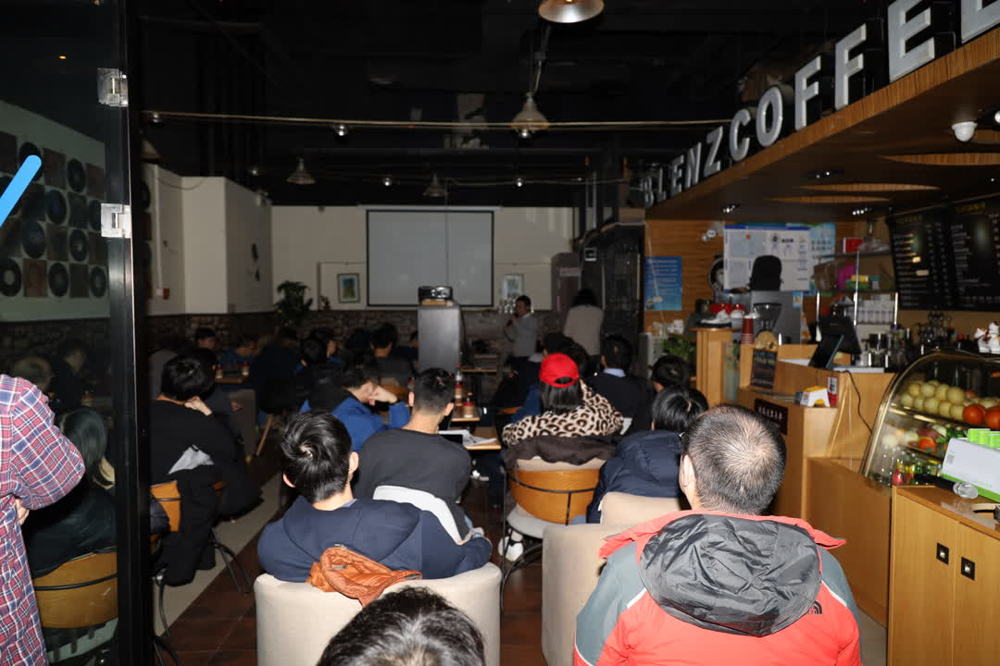

# Libra 技术设计与实现

6月18日，Facebook 发布了 Libra 白皮书及源码，引起了业界的广泛关注与讨论。业界对 Libra 的争论主要集中于它的金融以及商业影响，Westar 作为一个技术组织更关注 Libra 背后的技术。2020年1月4日，Westar 实验室组织了第一次技术 Meetup，分享 Libra 的技术设计与实现。本次 Meetup 主要探讨 Libra 技术设计和实现，涵盖了 Libra 的整体架构、Hotstuff 共识算法、Move 合约等关键议题。

Timyang 开场介绍 Westar dev meetup 以及 Westar。

**1、深入浅出聊一聊 Libra 架构**

讲师：邓启明 Westar实验室 技术专家

议题简介：

本次分享通过探索Libra的源码，聊一聊它的架构、核心组件（例如Consensus、Executor、Network、Storage等等）的一些内部实现，以及Libra的一些重要流程。

* ppt: [深入浅出聊一聊 Libra 架构](./ppt/libra_arch.pdf)
* 视频:[深入浅出聊一聊 Libra 架构](https://www.bilibili.com/video/av82304979)

**2、Hotstuff 共识算法完全详解及区块链架构**

讲师：Ted Yin 康奈尔大学博士，AVA Labs 首席研究员，共识算法 Hotstuff 设计者

议题简介：

深入分析 Hostuff 共识算法，以及共识算法和区块链架构的关系

* ppt: [Hotstuff 共识算法完全详解](./ppt/hotstuff.pdf)
* 视频:[Hotstuff 共识算法完全详解](https://www.bilibili.com/video/av82305588)

锁元老师带孩子来参加分享

**3、Starcoin 测试网搭建指南**

讲师：成锁元  Westar实验室 技术专家

* ppt: [Starcoin 测试网搭建指南](./ppt/starcoin_test_net.pdf)
* 视频:[Starcoin 测试网搭建指南](https://www.bilibili.com/video/av82302438)

**4、主题：从智能合约的演进看 Move 的架构设计**

讲师：王渊命(@jolestar) Westar实验室 首席架构师

议题简介：

Libra 的 Move 合约和 Ethereum 的合约有什么区别？它主要做了哪些改进点？这样设计的目的是什么？本次分享主要从智能合约的演进角度分析 Move 的架构设计。

* ppt: [从智能合约的演进看 Move 的架构设计](./ppt/libra_move.pdf)
* 视频:[从智能合约的演进看 Move 的架构设计](https://www.bilibili.com/video/av82300229)

**5、主题：浅谈区块链中间件系统设计**

讲师：吴啸 纯白矩阵CEO 

议题简介：

纯白矩阵曾推出首个集成Libra Move语言的IDE，本议题由浅入深介绍区块链中间件及开发者生态。

* ppt: [浅谈区块链中间件系统设计](./ppt/chainide.pdf)
* 视频:[浅谈区块链中间件系统设计s](https://www.bilibili.com/video/av82303913)

**听众图片**

### 关于 Westar dev meetup

Westar 探索区块链前沿技术实现，在区块链、底层性能、分布式方面有长期实践，期望将积累的经验与业界定期交流，同时欢迎从事互联网底层开发领域的同行一起交流。


