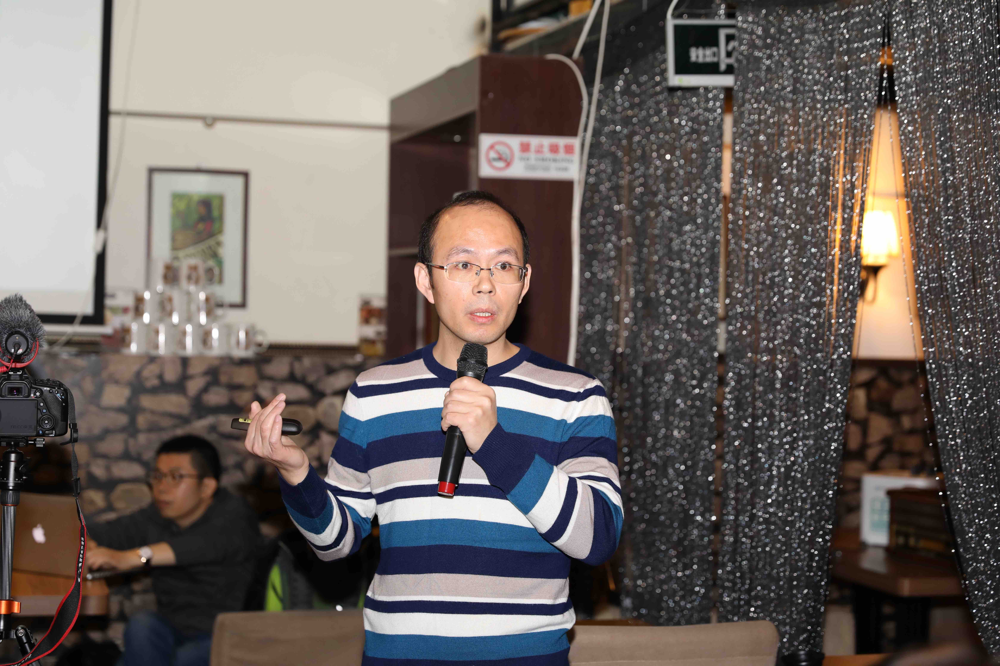
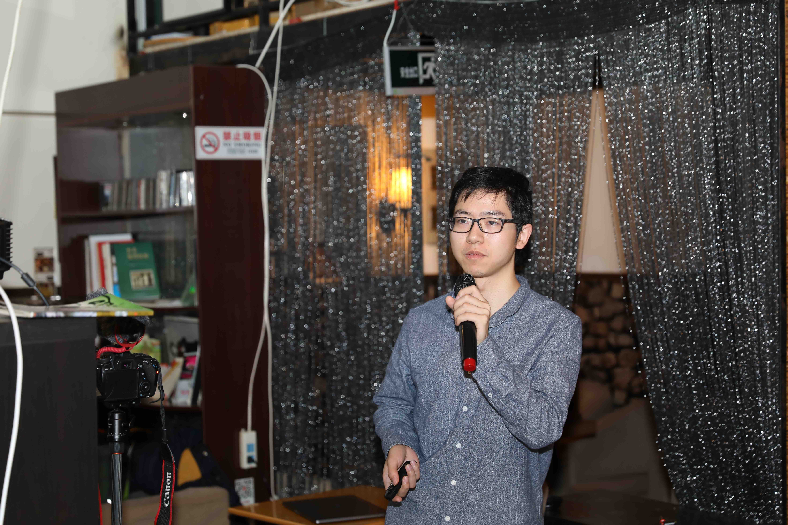
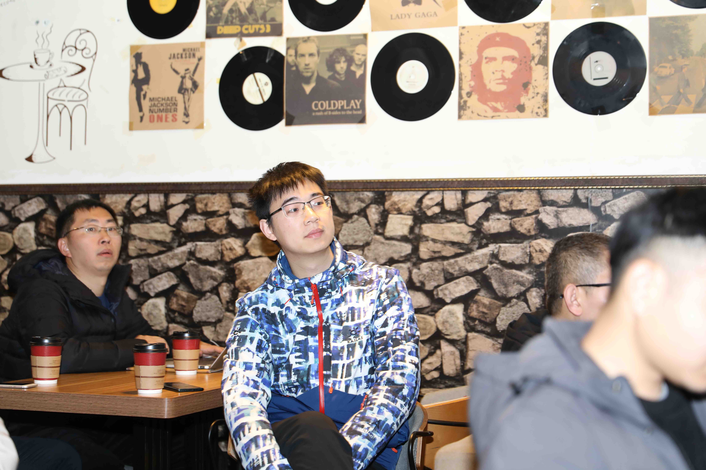
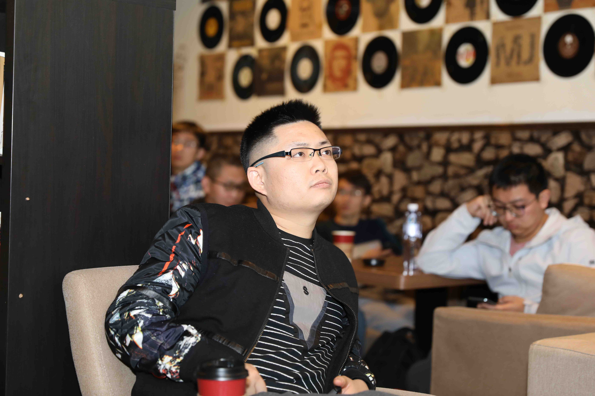
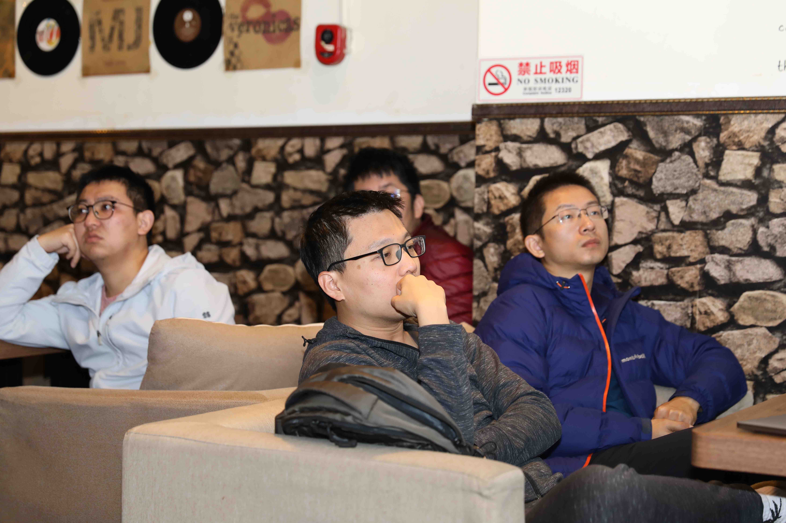
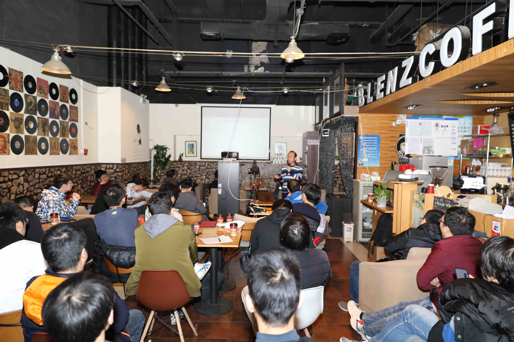

# Rust 开发年度回顾

2019年12月07日，Westar实验室组织了第一次技术Meetup，本次Meetup聚焦在Rust网络开发方面，包含三个主题，分别是Westar实验室研究员方圆带来的[《深⼊入浅出Tokio异步编程》](ppt/tokio_async.pdf),Westar实验室研究员成锁元带来的[《Rust Web框架⽐比较》](ppt/rustweb.pdf)，PingCAP团队资深开发者沈泰宁带来的[《Rust network programming:Futures and gRPC》](ppt/RustNetwork.pdf)。

三位讲师的分享引起参会者的学习热情，并在会后和讲师深入讨论了Rust网络开发相关的问题。

