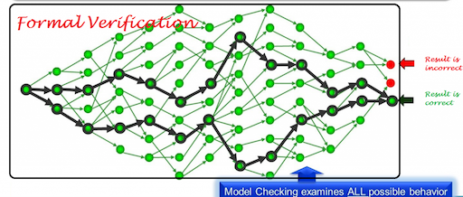
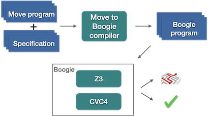
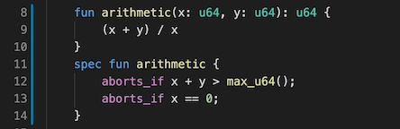
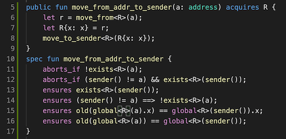

智能合约是一个对安全性要求非常高的领域，一个不经意的小bug很可能会导致不可估量的损失。不久前Raven Project爆出了一个非常低级的bug [1]：社区开发者提交了一个仅有几行修改的小patch，需要对三种情况进行检查，他故意漏掉了第三种情况，其实就是少了个“else”。核心开发者没有发现bug就接受了patch，最终攻击者利用自己提交的漏洞发行了3亿Raven Coin。

回溯智能合约发展的历史，这样的例子不胜枚举，其中最著名的要数The DAO攻击，它直接导致了以太坊硬分叉。造成这次安全攻击的原因，主要是由于The DAO项目方采用的转账模型是先给用户转账然后才对用户的余额状态进行修改，导致攻击者可以构造恶意合约在接受转账的同时，递归调用项目方的转账函数，致使用户的余额状态在没有被改变情况下，一直提取项目方资金。

应对智能合约中的bug，除了加强测试之外就没有更好的解决办法了吗？办法是有的！那就是形式化验证。形式化验证不是一项新技术，它实际上已经存在了30、40年了，主要用在军工、航天等对系统安全要求比较高领域。它是一种基于数学和逻辑学的方法，在程序部署之前，通过数学的手段对代码的正确性进行严格的证明，可以有效检测出程序是否存在安全漏洞。和传统的靠人工来查找代码漏洞的手段相比，形式化验证可以解决人工手段无法穷举所有可能输入的缺陷。

注：图片来自internent，未找到确切来源，在此对图片作者表示感谢！

Move作为新一代智能合约编程语言，为了支撑Libra做为金融基础设施、赋能全球几十亿人的愿景，将安全作为了首要设计目标。Move语言的安全特性可以分为三个层面，分别是语言层面、虚机层面、工具层面。语言层面有类似于Rust的ownership系统、借助Module-script形成的强数据抽象，以及资产作为一等公民；虚机层面有类似于Java的字节码校验器；工具层面则提供了基于Boogie的形式化验证工具。

Move的形式化验证工具叫做Move Prover，它的基本思想是通过形式验证领域的自动定理证明求解器来验证程序是否符合某种规范(specification)。这种方法需要用户详细了解程序运行逻辑，将程序逻辑表示成规范然后和程序一起传达给验证系统。Move自己定义了一套规范语言叫做Move specification language，它通过前提条件、后置条件、不变式等来描述程序怎么样才算正确运行。然后通过一个Move to boogie compiler将 Move程序和规范转换成boogie程序——一种具有形式化语义的中间验证语言。

Boogie是微软开发的，它有两层含义。首先它是一种具有形式化语义的中间验证语言，目的是为其他语言构建程序验证器。目前基于Boogie语言已经构建了多个程序验证器，比较著名的包括C语言的VCC和HAVOC验证器等。同时Boogie也是工具的名称。 该工具接受Boogie语言作为输入，生成验证条件然后传递给自动定理证明求解器Z3或者CVC4。默认的求解器为Z3，它是一种SMT - Satisfiability Modulo Theories（可满足性模理论）求解器。可满足性模理论属于逻辑学范畴，简单理解就是它最终会给出一个结果，要么是输入的程序符合给定的规范，要么是不符合。不符合时会给出具体路径。 

下面我们通过一个例子，看一下如何通过Move prover来发现程序中隐藏的bug。这个arithmetic()方法计算两个64位无符号整数 x、y 的和，然后除以 x，返回结果。乍一看这个方法没有什么问题，实际上它隐藏了两个bug，溢出和被0除。底下同名的spec fun就是用Move specification language书写的规范。它通过两个aborts_if条件语句规定了arithmetic()所有可能的异常退出路径。第一个aborts_if描述了因为上溢而退出，第二个aborts_if描述了除数为0异常退出。假设你一开始并不知道arithmetic()有可能会异常退出，spec fun arithmetic中并未包含任何abort_if条件，那么你运行move prover，结果会显示有异常退出的路径没有被规范包含，并且会详细列出上述两个异常退出的路径。看到这些提示后，就知道要修改arithmetic()方法，增加对于溢出和被0除的判断。

再看另一个例子。如果对Move语言有所了解，会知道Move提供了专门的bytecode用来移动资源。下面这个Move方法，就是将R类型的资源从地址a下面移出来，然后再重新打包一下放到sender的地址下。这个方法有两个异常退出路径，一条路径是地址a下面没有R资源，另一条路径是sender不等于a的情况下，sender下已经存在另一个R类型的资源了。如果sender等于a，不会有问题，因为把R从sender下移出，再移入sender，没有问题。如果sender不等于a，就会有问题，因为Move语言规定一个地址下只能存储一个同一类型的资源，sender下已经存在一个R类型的资源，就产生冲突了。如果删除第11行或者12行的退出条件，move prover就会报告有异常退出路径没有被规范覆盖。开发者就可以根据具体路径来修改程序，增加这两个条件判断。

通过上面两个例子我们可以大致了解move prover的用法，详细的使用说明可以参考Libra 代码中附带的相关文档[2]。正如Move白皮书里提到的，Move的长期目标是建立一种“正确性”文化，在这种文化中，用户要想了解一个合约的功能，首先会去查看它的规范。 理想情况下，Move程序员不会去使用没有经过形式验证的合约。 但是，想要实现这一目标面临的挑战是非常大的。形式化验证工具需要用户详细了解程序运行逻辑，然后以规范的形式传达给验证系统，验证工具是否准确、直观，规范是否模块化、可重用，可读性是否足够好，这些都是形式化验证工具面临的挑战。Move的形式化验证工具还处在实验阶段，但是我们相信在不久的将来，它必将成为智能合约编程必不可少的工具。

本文作者**朱光宇**(@guangyuz)，区块链爱好者，前阿里巴巴 JVM 专家。现就职于Westar 实验室，从事智能合约编程语言、安全和可扩展性方面的研究。

参考文章：

1. https://github.com/ravenproject/ravencoin/commit/d23f862a6afc17092ae31b67d96bc2738fe917d2
2. https://github.com/libra/libra/tree/master/language/move-prover/doc/user

