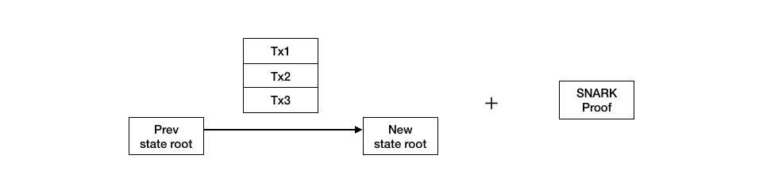
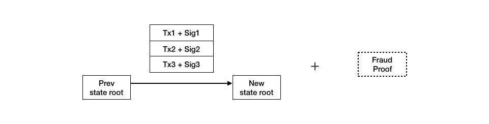
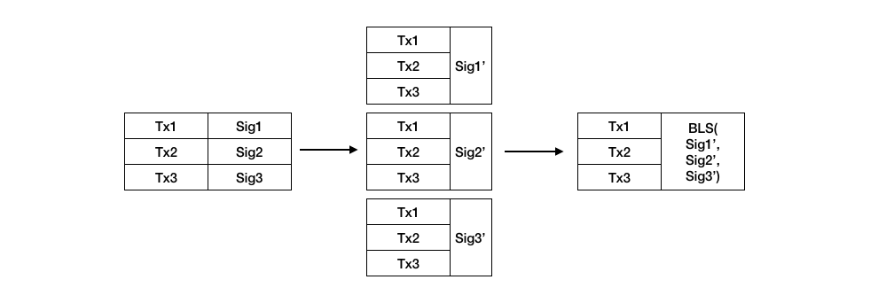
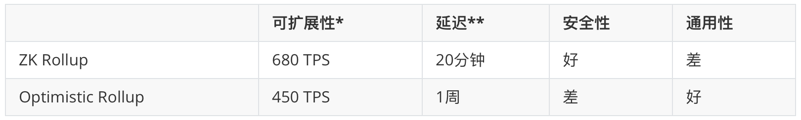

最近，以太坊创始人 Vitalik Buterin 在一篇题为“混合式二层协议的曙光” 的文章[1]里对 Rollup 方案大加赞赏，认为它为智能合约的可扩展性打开了大门。那么什么是 Rollup ？它包括哪些主流方案？这些方案各自有什么优缺点？它们未来发展前景怎样？为了找到这些问题的答案，笔者对相关项目做了一番调研，将收集到的信息整理成下面这篇文章。

#### Rollup 的出现

最近几年，以太坊二层（Layer-2）扩容技术得到迅猛发展。所谓二层，就是将一部分资金存储在主链智能合约里，在保证足够安全的前提下，把一部分交易放到主链之外进行，好像链下多出来一层网络。二层方案里表现比较突出的是状态通道和 Plasma 侧链。虽然这两种方案诞生时间很早，但是发展的却比较缓慢。其背后的原因归根结底是数据的可用性（Data Availability）问题。

什么是数据可用性呢？这里有个不太恰当的例子。假设你去赌场玩扑克，首先要把现金换成筹码，这可以理解成在链上创建状态通道，并存入押金。然后你开始玩扑克，这就是所谓的链下交易。在赢得一手大牌之后，你想要兑现走人，突然有人给你脑后来了一闷棍，醒来后桌上的筹码不翼而飞。你记不起来牌局的细节，所以无法追回已经赢得的筹码，这就是所谓的“数据不可用”。无论是状态通道还是 Plasma 侧链，完整的交易记录和见证数据都只保存在链下，出现争端时如果参与者没有及时提供正确的交易和见证数据，交易的安全性就无法保证。就好像是那个忘记了牌局细节的人，很难追回属于自己的筹码。

就在二层扩容技术举步维艰的时候，一种名叫 Rollup 的新方案被提了出来。与状态通道和 Plasma 不同的是，它可以“打包”交易，并将“打包”后的交易数据连同一个 SNARK 零知识证明发布到链上。打包的正确性可以通过零知识证明来见证，负责“打包”的操作者不可能发布恶意或无效的交易。这就是后来被 Vitalik Buterin 称之为 ZK Rollup 的二层扩容方案。ZK Rollup 并非万能，它遇到的最大问题是通用性。除非要证明的交易非常简单，否则创建 SNARK 证明的成本会非常高。因此，一种名叫 Optimistic Rollup 的折衷方案被提了出来。Optimistic Rollup也是把交易数据都放到链上，但不是用 SNARK 做见证，而是采用“加密经济学有效性博弈”来实现有效性验证。

#### 工作原理

Rollup 的核心思想是将“打包”后的交易数据区块发布在链上，从而降低交易有效性验证的难度。交易数据的上链和验证是基于智能合约完成的。操作者收集到不同参与者提交的链下交易后，在链上执行 Rollup 智能合约提供的脚本，将打包后的交易数据区块作为参数提交给合约，合约验证数据有效后为每个参与者记账。这相当于一次性执行了一批链下交易，但是在链上只执行了一个交易。

下图是 ZK Rollup 提交上链的打包数据。它包含一组压缩后的交易数据 [Tx]（不包含任何签名）、执行这批交易之前的老的用户状态的 merkle 树树根，以及执行交易之后的新的用户状态的 merkle 树树根。除此之外还包含一个 SNARK 零知识证明，合约用它来验证在老的用户状态上施加这批交易 [Tx] 后结果就是新的用户状态。零知识证明具体是如何工作的？这不是三言两语就能解释清楚的，大家可以参考文章[2]，里面对零知识证明的工作原理做了详细阐述。

生成 SNARK 的成本非常高，所以 Optimistic Rollup 采用了不同的方法——“欺诈证明”来验证交易有效性。这里的“欺诈证明”并非 SNARK 那样的见证数据，它实际上指的是加密经济学有效性博弈（Cryptoeconomic Validity Game）。越说越晕了#¥¥%......，其实很简单，就是每次打包后的交易被提交到链上时，智能合约都假定它们是正确的，无需验证。如果有人篡改了交易，操作者或者其它参与者都可以挑战非法交易，挑战成功后通过智能合约回滚不正确的区块，作弊者会受到惩罚，它的押金将会被没收，部分押金会奖励给挑战者。这就是所谓的基于加密经济学有效性博弈的“欺诈证明”，实际上是让参与各方互相监督，通过惩罚机制来提高作弊成本。为了实现“欺诈证明”，光有 ZK Rollup 那样的交易数据 [Tx] 是不够的，Tx数据需要包涵交易提交者的签名，合约通过校验签名来判断交易是否合法。

#### 安全性

Rollup 的安全性来自于数据可用性和交易有效性。有了数据可用性和交易有效性，就能保证 Rollup 操作者永远不能破坏状态或窃取资金，即使操作者不配合，参与者也能方便的追回 Rollup 网络上的资产。Rollup 将交易数据发布到链上，就像“锚”一样将 Rollup 网络锚定到了以太坊主链上。就好比是赌场里装上了摄像头，即便是玩扑克的人被打了一闷棍，还是能通过视频记录证明自己确实赢了钱。

对于交易有效性验证，ZK Rollup 和 Optimistic Rollup 采取了不同的方法[3]。ZK Rollup 采用零知识证明来保证交易有效。它的安全性建立在密码学基础之上，智能合约仅在交易数据被证明为正确之后才会接受状态转换。每次状态转换都有一个零知识证明，这保证了链上总是对应着一个正确的二层状态。Optimistic Rollup 采用基于加密经济学有效性博弈的“欺诈证明”，它无需为每一次状态转换都提供证明，只在有人认为状态转换有误的时候提供。因为沉默将被视为同意，所以它要求交易方必须每时每刻都要在线。相比较 ZK Rollup，Optimistic Rollup 的安全性有所降低，它需要采取额外的措施来防止 DDoS 攻击造成的“默许”。

#### 可扩展性

Rollup 通过一次链上交易可以执行一大批打包后的链下交易，主链不需要通过执行每笔交易来验证其有效性，而且交易数据是作为函数参数发布的，验证完有效性后就会被丢弃，这样就不会占据主链的存储空间。因此 Rollup 可以大幅度提升主链的可扩展性。

但是这种提升并非没有限制，虽然只有一次链上交易，但是它会受到交易数据本身 gas 成本的制约。以太坊数据的 gas 成本在伊斯坦布尔升级前是每字节 68 单位，而以太坊上每个地址就会占用 20 字节，所以如果用以太坊交易的数据结构来表示链下交易，gas 费用会非常高，因此 Rollup 对交易数据进行了压缩。

ZK Rollup 在智能合约里用 merkle 树来记录地址，这样地址就可以表示成树的索引值，地址数据的大小就从原本的 20 bytes 减少到只有 3 bytes 到 4 bytes。每笔交易就被压缩成 10 几个字节，再加上一个约 100-300 字节的 SNARK，理论上可以将以太坊吞吐量从 32 TPS 提升到约 680 TPS，伊斯坦布尔升级后可达到 2000 TPS。下图是压缩后 ZK Rollup 每笔交易数据的格式：

Optimistic Rollup 的吞吐量理论上只有 100 TPS，主要原因是上文提到过的，为了支持“欺诈证明”，Optimistic Rollup的每笔交易数据需要包涵交易提交者的签名。每条签名的大小是 64 bytes，这大大增加了提交上链的交易数据的字节数，从而很快达到 gas 上限。为了减少交易数据的字节数，一种 BLS 聚合签名机制被提了出来。如下图所示， BLS 聚合签名机制是在操作者收集到所有交易后，将打包后的交易发送给每个交易提交者签名，因为每个签名都是针对相同的数据，所以可以被操作者聚合成一个 BSL 签名。发送给链上合约的将是压缩后的交易数据加上聚合后的 BLS 签名，从而大幅减少了交易数据所消耗的 gas。BLS 签名可以将 Optimistic Rollup 的吞吐量从100 TPS提升到 450 TPS，伊斯坦布尔升级后也可以达到 2000 TPS。

#### 延迟

Optimistic Rollup 基于加密经济学有效性博弈，只有过了1～2周的挑战期才能确认交易生效。ZK Rollup的延迟相对较小，如果一个打包区块中有 1000 笔交易，在普通的服务器上大概需要 20 分钟可以构造出一个证明。开发者已经提出很多减少延迟的方法，比如采用 GPU 加速可以将零知识证明构造时间压缩到 1 分钟。还有一种叫做“即时交易收据”（instant tx receipts）的方法两种 Rollup 方案都适用。它主要借助经济学博弈来完成，就是负责打包的操作员需抵押一部分安全保证金，如果某个交易没有被打包到区块中，这笔钱就会被没收。理论上“即时交易收据”可以将交易确认时间压缩到 1 秒以内，但是实现相对复杂，安全性有所降低。

#### 通用性

通用性方面，Optimistic Rollup 明显好于ZK Rollup，当然它的设计目标就是支持任意智能合约。而 ZK Rollup 目前仅适用于支付之类的特定交易，对于通用智能合约，由于创建零知识证明的成本非常高，部署起来困难较大。为了提高效率， 开发者正在开发专门的零知识证明虚拟机，比如 ZEXE。它在一定程度上可以缩短创建证明的时间，但是缺点是合约开发者需要大量的专业知识。Matter Labs团队基于ZK Rollup开发的新一代区块链扩展方案 ZK Sync[4]，设计开发了一款以委托的方式生成零知识证明的沙盒式虚拟机，开发者不需要深入了解零知识证明领域的技术细节就可以编写出高效且安全的智能合约。

#### 总结与展望

本文简要介绍了区块链扩容方案 Rollup 的工作原理，对比分析了两种 Rollup 方案 ZK Rollup 和 Optimistic Rollup 在可扩展性、延迟、通用性、安全性上的优劣。

（可扩展性*伊斯坦布尔升级后可达到2000 TPS；延迟**使用“即时交易收据”优化后可达1秒）

根据以上的对比分析，短期看来 Optimistic Rollup 由于较好的通用性会受到开发者的青睐；但从长期来看，随着零知识证明虚拟机的演进，ZK Rollup 会在通用性上不断提高。它能否主宰智能合约可扩展性的未来呢？这个问题只能留给时间来回答了。

#### 参考文章

1. “混合式二层协议的曙光” https://vitalik.ca/general/2019/08/28/hybrid_layer_2.html
2. “零知识证明–zkSNARK 入门” https://mp.weixin.qq.com/s/M1ZAXPSPqO8KpE3VyExwTw
3. “有效性证明和错误证明” https://medium.com/starkware/validity-proofs-vs-fraud-proofs-4ef8b4d3d87a
4. “ZK Sync 介绍” https://medium.com/matter-labs/introducing-zk-sync-the-missing-link-to-mass-adoption-of-ethereum-14c9cea83f58
