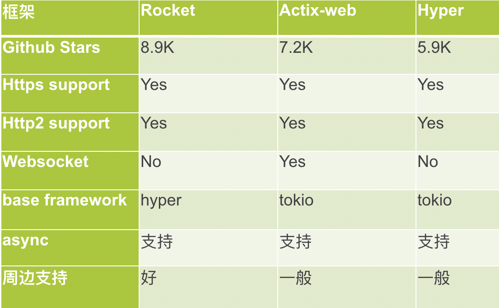
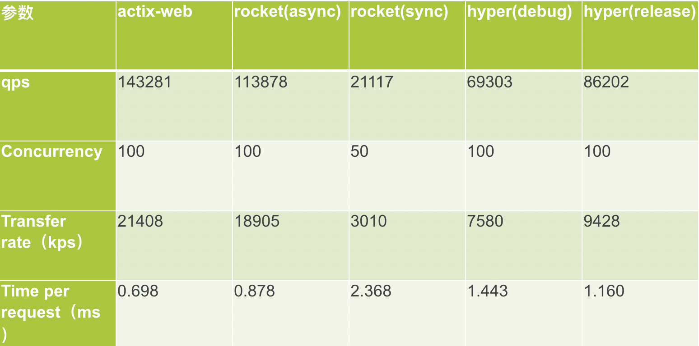

Rust语言这两年在“安全、并发、性能”方面吸足了眼球，但在主流的web应用领域表现如何？有哪些可以推荐的Web框架？下面就这个话题深入展开。

## 背景
### Web框架

我们先简单回顾下Web框架：
Web框架主要用于动态Web开发，开发人员在框架基础上实现自己的业务逻辑。
Web框架需要实现接收到请求后，能够提供参数校验的能力，然后根据请求参数从底层拿到数据，最后以特定格式返回。Web框架旨在简化web开发流程，让开发人员更专注于自己的业务逻辑。

### 其他语言现状
其他主流语言，Web框架都已经发展非常成熟，大家耳熟能详的比如：

* PHP语言： Laravel
* JAVA语言：Spring MVC
* GO语言： Gin/Beego

这些框架介绍的文章已经满大街了，在此就不赘述。

## Rust常见Web框架
Rust目前已知的Web框架也有几十种，在flosse的rust-web-framework-comparison开源项目里面详细列出（见文末参考资料的链接），感兴趣的可以查看。但遗憾的是官方也没有给出支持或者推荐的Web框架，所以我们就实际项目简单使用的情况，挑出几个比较下，希望给大家选型框架时参考下。

### Rust Web框架的难点
在比较这些框架之前，我们先回顾下Rust语言处理Web流程困难的地方。众所周知，Rust近年发展迅猛，同时也带来一些新的概念，比如生命周期等，另外rust没有全局状态，或者说实现比较困难，以及编译检查比较严格，相对速度也比较慢，这样对实现web框架带来一些困难，下来我们看下这些框架的实现情况。

### Rust Web框架分类
Rust Web框架中，hyper、h2、tiny-http属于底层一些的框架，比如hyper，很多框架都是基于它开发的，它也是Rust语言中比较老牌的框架；Rocket框架相对比较专注， 大名鼎鼎的tokio的作者实现的Tower，目前跟warp交流较多，有可能会合并大家也可以持续关注；iron、gotham、nickel、rouille、actix-web功能相对全面些，就像其中Actix框架整个体系庞大，下面又拆分出许多子框架：web、http、net等。

## Rust主流Web框架的比较
下面我们终于进入正题，挑出几个我们实际项目中使用过的框架进行比较。当然，可能有些框架的特性我们并未涉猎，文中有不妥之处欢迎指正。
### Hyper
第一个出场的就是hyper，它的特点就是高性能，后面会给出的压测结果，跟actix-web差不多；另外首先实现了Client组件，方便写单元测试验证；前面也提到很多web框架基于hyper实现，侧面说明他底层的封装还是不错的。不过它也有些缺点：

* hyper应用侧的功能相对少，所以会导致很多框架又在他的基础上继续封装；
* 通过match block实现路由，这个笔者认为是一个比较明显的缺点；
比如下面的例子：

```

async fn response_examples(
    req: Request<Body>,client: Client<HttpConnector>
) -> Result<Response<Body>> {
    match (req.method(), req.uri().path()) {
        (&Method::GET, "/index.html") => {
            Ok(Response::new(INDEX.into()))
        },
       (&Method::GET, "/json_api") => {
            api_get_response().await
        }
        _ => {
   Ok(Response::builder().status(StatusCode::NOT_FOUND)
                .body(NOTFOUND.into())
                .unwrap())
        }
    }
}

```
这是一个典型的hyper的实现，但实际项目中的match块处理较复杂的流程时往往需要翻一两页，这样开发和review都相对困难。

### Actix-web
Actix-web是已知的所有web框架实现了actor模型，由微软的工程师 Nikolay 开发，Azure用的比较多；超级快是另一个优点，在web性能评测网站刷榜，但有取巧嫌疑，下面会展开说下他怎么做的；底层基于tokio。整体层级结构如下：

 * tokio && futures -> actix-net/actix-rt -> actix-net/其他子crate -> actix-web

 对于整个actix来说，功能还是比较丰富；今年6月发布的的1.0，进一步简化actor模块，service替代handle，大量的简化代码。
 
 * 缺点：大量的unsafe(如下图)，导致经常有开发爆出堆栈溢出的bug；这也是他性能最好的原因之一；
 
 

他的另外一个缺点，代码质量不高，频繁变动，至少是web模块这块，文档和实例也不全；比如0.7版的handle，到1.0版变成service，他封装的responder，也不稳定，下面跟rocket的实现一起展开比较。

### Rocket
Rocket是目前Rust主流的Web框架之一，github项目有8.9k的star。而它的http处理部分就是基于前面提到的Hyper。从官方资料看，具有如下三个特点：

* 类型安全；
* 上手简单，让你更专注于自己的业务； 
* 组件丰富，且几乎都可以自定义；

Rocket从笔者使用经验来看：确实上手非常快，对各种语言背景的开发人员都相对友好；扩展容易，他的组件几乎都可以自定义，requestGuard、state、fairing 都可以定制；另外，文档、example都非常详细，预定义很多宏，非常方便；
Rocket的缺点：性能上会略差些，后面会给出压测数据。不过他的async分支也快发布，都打磨了几个月，大家可以关注；

### 汇总
简单汇总一个表格（如下图），总结下：从大家的关注度上，Rocket胜出；Actix-web的功能会多些，比如websocket等；从使用和应用层的周边支持上，Rocket做的最好；所以不太在意性能的话，建议选择Rocket。下来我们就就详细讨论下Rocket。
 

## Rocket
### Rocket设计原则
首先看下rocket的设计原则，这也是其他框架没有的，而且他们实际代码落地上也履行的不错，具体原则如下：

* Security, correctness, and developer experience are paramount.
* All request handling information should be typed and self-contained
* Decisions should not be forced

笔者的理解：

* 安全性，正确性和开发人员经验至关重要。这就充分挖掘了rust安全方面的优势，且对各语言开发人员友好， 后面讲到request、guards这两个组件再展开下；
* 所有被处理请求信息都必须指定类型。这样也对开发人员有所约束， 比如在使用Responder组件就深有感触；
* 不应该强行限制。他的模板、序列化、会话等组件，几乎所有的功能都是可选择的插件形式。对于这些，Rocket都有官方库和支持，完全可以自由选择和替换。
所以，Rocket是Rust Web框架里面，完美的平衡了自由和约束。下面我们就几个重要组件详细展开。

### RequestGuards
RequestGuards有些类似java的spring框架的velidator，是代表任意验证策略的类型，验证策略通过FromRequest实现。RequestGuards没有数量限制，实际使用中根据自己需求添加，也可以自定义Guards。举个例子：

```

#[get("/<param>")]
fn index(param: isize, a: A, b: B, c: C) -> ... { ... }

```

上述例子中的A、B、C都是具体的实现，比如A验证auth，B验证计数，C具体业务校验等；也可以用框架已经实现的guard，或者自己定义，整体还是非常灵活。
guard组件也是履行他的第一个设计原则：正确性、安全性；

### Responder
我们直接看下Responder的定义：

```
pub trait Responder {
    /// Returns `Ok` if a `Response` could be generated successfully. Otherwise,
    /// returns an `Err` with a failing `Status`.
    ///
    /// The `request` parameter is the `Request` that this `Responder` is
    /// responding to.
    ///
    /// When using Rocket's code generation, if an `Ok(Response)` is returned,
    /// the response will be written out to the client. If an `Err(Status)` is
    /// returned, the error catcher for the given status is retrieved and called
    /// to generate a final error response, which is then written out to the
    /// client.
    fn respond_to(self, request: &Request) -> response::Result;
}
```
笔者翻了一下这个trait的代码记录，从16年最开始设计就已经确定，非常稳定，之后再没有更新过。respond_to返回的Result，他封装了一下，要么是OK，要么是一个Err的status。
另外内置实现了常用的类型（ str 、String、  [u8] 、 File、  Option、 Status
），基本覆盖绝大部分业务场景；如果还不能满足，那你也可以实现自定义的responder。
这也就体现他的第二设计原则：类型约束。不像其他的框架，比如Actix-web也有responder，但也是最近的版本才稳定下来。如下要想自定义怎么办？
这是一个自定义的例子：

```
impl Responder for Person {
    fn respond_to(self, _: &Request) -> response::Result {
        Response::build()
             .sized_body(Cursor::new(format!("{}:{}", self.name, self.age)))
             .raw_header("X-Person-Name", self.name)
            .header(ContentType::new("application", "x-person"))
            .ok()
     }
 }
#[get("/person")]
 fn person() -> Person { Person { name: "a".to_string(), age: 20 } }
```
这就是自定义的一个responder，直接返回一个Person对象；也可以加上err的处理；看起来还是比较简单吧。我们可以对比下Actix-web的responder的实现：

```
pub trait Responder {
    /// The associated error which can be returned.
    type Error: Into<Error>;

    /// The future response value.
    type Future: Future<Output = Result<Response, Self::Error>>;

    /// Convert itself to `AsyncResult` or `Error`.
    fn respond_to(self, req: &HttpRequest) -> Self::Future;


    fn with_status(self, status: StatusCode) -> CustomResponder<Self>
        where
            Self: Sized,
    {
        CustomResponder::new(self).with_status(status)
    }


    fn with_header<K, V>(self, key: K, value: V) -> CustomResponder<Self>
       … …
}

```
Actix-web是19年3月份才有这个组件的，status，header还是后来加；实现的起来复杂的多；

### State
我们看下Rocket的State组件，也是最后一个原则的体现。直接举例说明：

```
use rocket::State;
use rocket::response::content;

struct HitCount(AtomicUsize);

#[get("/")]
fn index(hit_count: State<HitCount>) -> content::Html<String> {
    hit_count.0.fetch_add(1, Ordering::Relaxed);
    let msg = "Your visit has been recorded!";
    let count = format!("Visits: {}", count(hit_count));
    content::Html(format!("{}<br /><br />{}", msg, count))
}

#[get("/count")]
fn count(hit_count: State<HitCount>) -> String {
    hit_count.0.load(Ordering::Relaxed).to_string()
}

fn rocket() -> rocket::Rocket {
    rocket::ignite()
        .mount("/", routes![index, count])
        .manage(HitCount(AtomicUsize::new(0)))
}


```

这是一个计数器的简单实现，通过state注入到handle中，每次访问/都加1；也可以通过/cout接口拿到当前计数；这两接口是无状态的，但count是全局的，这就是state的魅力；
当然state可以干的事情很多，另外也内置实现了Request-local state，类似于thread-local
可以做链路跟踪；

### Fairing

Rocket还有个Fairing组件，结合上面提到的state组件，可以实现应用启动时，或者state的attach时，请求和响应时的一些定制；比如定制filter，日志等插件都可以实现；

```
#[derive(Default)]
struct Counter {
    get: AtomicUsize,
    post: AtomicUsize,
}
impl Fairing for Counter {

    fn on_request(&self, request: &mut Request, _: &Data) {  
… …}

    fn on_response(&self, request: Request, response: mut Response)
      {… …}
}
fn rocket() -> rocket::Rocket {
    rocket::ignite()
        .mount("/", routes![… , …])
        .attach(Counter::default())
           … …
}

```
这是一个根据请求方法不同而分别计数功能，你也可以实现Counter的attach的事件处理；但跟filter不同，Fairing更通用些。其特点如下：

* 挂载在Request的生命周期
* 不能终止或者直接响应Request
* 不能将非请求数据注入Request
* 可以检查或者修改配置
* 只有attach了才能触发
* 顺序很重要

Fairing可以应用在一些动态改配置的场景，或者多种环境的复杂配置场景；且官方贴心的内置了Adhoc实现，方便开发人员快速实现。

至此，Rocket的特性就讲完了，所以建议大家根据自己的实际需求，来选择自己合适的框架。

## 压测数据参考
最后我们给出之前做的压测结果：
 
 
上述表格中Rocket sync（master分支）并发只能到50，如果业务场景非常注重性能的话，那你就慎重考虑，或者你持续关注async分支的进展；另外比较了hyper框架debug和release方式的差异，其他的差异比例也类似。

## 参考资料
1. [Hyper官网](https://hyper.rs/)
2. [Rocket官网](https://rocket.rs/)
3. [Actix-web官网](https://actix.rs/)
4. [rust Web框架的比较](https://github.com/flosse/rust-web-framework-comparison)
5. [the-best-rust-frameworks-to-check-out-in-2019](https://blog.logrocket.com/the-best-rust-frameworks-to-check-out-in-2019/)


