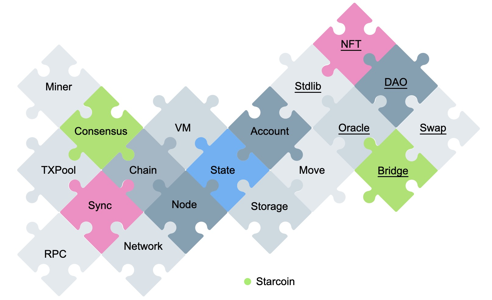
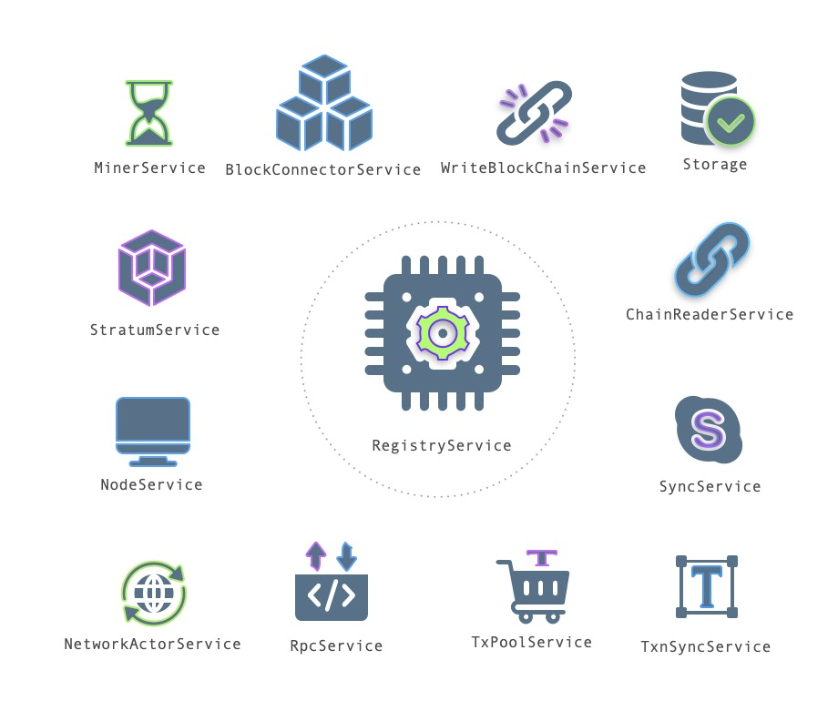
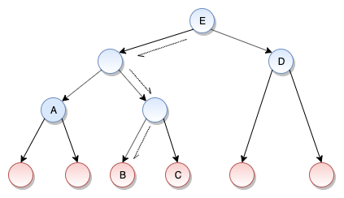
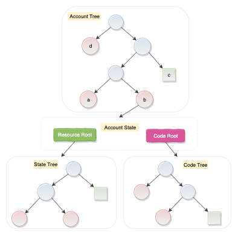
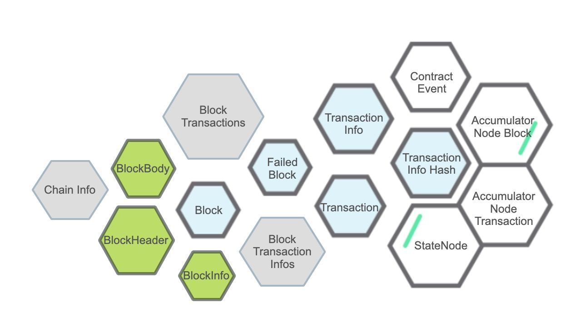
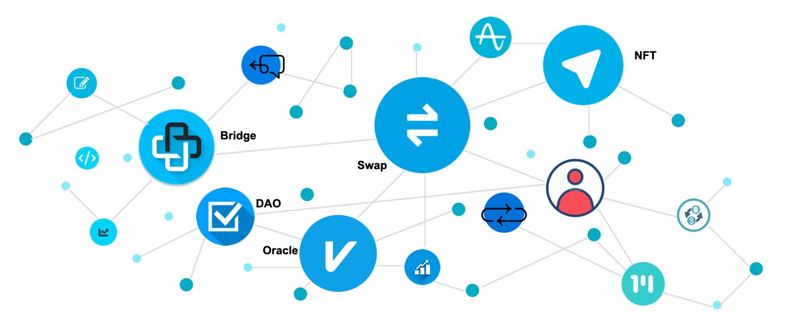

## Starcoin的架构

2021年5月18日，Starcoin，新⼀代分层的智能合约和分布式⾦融⽹络，正式启动主网。Starcoin使用增强的PoW共识，是首个使用Move作为智能合约语言的无许可公链，也是把DAO链上治理做得最彻底的公链。Westar实验室作为开源技术的爱好者，有幸接触了一些Starcoin的设计和实现，为开源社区贡献了一点点力量。这里，我们从技术的角度，介绍一下Starcoin。

Starcoin是一个比较庞大的系统，我们先从宏观上了解一下Starcoin的整体架构。如图所示，Starcoin包含非常多的组件，例如Chain、Sync、TxPool、Stdlib等等。从整体上来说，Starcoin包括两大部分：

* 链，Rust，图中未划线部分
* 合约，Move，图中划线部分

我们可以简单的将「链」和「合约」通过编程语言区分。链相关的逻辑是通过Rust实现的，而合约则通过Move表达。虽然逻辑上将Starcoin分成了「链」和「合约」两部分，但是「链」和「合约」又起到相互支撑、相互促进的作用。「链」是「合约」的基础，为合约提供运行环境。而「合约」又为「链」提供养分，表达链的一些核心状态，例如区块奖励等等。所以，「链」和「合约」是一个相互作用的统一整体。

### Starcoin的核心Service

前面我们从宏观的角度，了解了一下Starcoin的整体架构，接下来，我们分别介绍一下Starcoin的「链」包含的核心组件、服务和功能。

Starcoin借鉴微服务的思想，将不同的模块进行拆分，再通过服务的方式，将不同功能组织起来，以节点的方式统一提供服务。Starcoin使用了Rust的Actix框架，设计了一套功能完善的service-registy系统，包括服务注册、服务状态检查、服务关闭等能力，能非常方便地管理服务的生命周期。同时，为服务之间通信设计了一套Bus协议，将服务解耦。如图所示，service-registy模块中的RegistyService是所有其他服务的基础服务。

* node模块中的NodeService表示节点服务，代表了一个Starcoin的节点，主要用于初始化节点需要的服务，是Starcoin节点启动的入口；
* network模块的NetworkActorService表示网络服务，用于处理Starcoin网络消息，例如建立节点连接、广播区块、同步交易等等；
* rpc模块的RpcService表示Rpc服务，用于管理ipc、tcp、http和websocket请求，包括管理对外的接口、限流等功能；
* txpool模块的TxPoolService表示交易池，用于管理本地的交易，是普通用户使用最多的服务之一；
* sync模块的TxnSyncService表示交易同步服务，用于从Starcoin网络的其他节点同步交易；
* sync模块的SyncService表示区块同步服务，用于从Starcoin网络的其他节点同步区块；
* chain模块的ChainReaderService表示读取链服务，通常用于查询区块、状态等操作；
* storage的Storage表示链的存储，所有链相关的数据，都存储在Storage中；
* stratum模块的StratumService是矿池服务，实现了矿池协议，用于跟矿机打交道；
* miner模块的MinerService是挖矿任务管理服务，用于组装区块，生成挖矿任务；
* sync模块中的BlockConnectorService表示连接区块的服务，将网络同步过来的区块、网络广播过来的、本地节点挖的区块连接到链上；
* sync模块中的WriteBlockChainService表示区块的写服务，验证区块、更新区块和状态，维护最新的链状态；

以上是Starcoin比较核心和重要的Service，还有一些其他的Service这里没有介绍。

## Starcoin的Storage

前面介绍了Starcoin的核心服务，所有的服务协作的结果是将数据存储起来，并且保证所有分布式节点的状态最终一致，所以，我们再深入介绍一下Starcoin的Storage相关的内容。

Starcoin的数据保存在Storage中，在介绍Storage之前，我们先来简单了解一下Starcoin两个非常特别的核心数据结构：

* 双MerkleAccumulator
* GlobalStateTree，双层结构的三个Tree

### 双MerkleAccumulator

MerkleAccumulator，如图所示，是Starcoin一个非常核心的数据结构，用于提供区块和交易的证明。MerkleAccumulator的特点是叶子节点可以从左到右不断增累加，然后构建成一个树形的MerkleAccumulator，最后将Root节点的哈希保存到区块中。使用MerkleAccumulator的好处是可以非常轻松地证明一个区块或者交易是否在链上，例如，图中叶子节点B的Proof是CAD。Starcoin巧妙地设计了两个MerkleAccumulator，分别为区块和交易提供证明，对应BlockHeader的block_accumulator_root和txn_accumulator_root，这就是Starcoin的“双MerkleAccumulator”。

### GlobalStateTree

Starcoin的GlobalStateTree设计上也很有意思，由双层结构的三个Tree构成，如图所示：

* 上层AccountTree的Root是BlockHeader的state_root
* 上层AccountTree的叶子节点映射到下层Tree的ResourceRoot和CodeRoot
* 下层StateTree的叶子节点映射到Account的Data区数据
* 下层CodeTree的叶子节点映射到Account的Code区数据

双MerkleAccumulator和GlobalStateTree的数据最终也会保存到Storage和StateDB中。

### Storage

Starcoin的Storage使用了Key-Value的RocksDB，存储了所有的区块、交易和用户状态等数据，如图所示，总共15个ColumnFamily（ID都表示Hash）：

* ChainInfo：保存链的master分支的Head Block等节点启动数据
* Block：保存Block的ID与Block的映射关系
* BlockHeader：保存Block的ID与BlockHeader的映射关系
* BlockBody：保存Block的ID与BlockBody的映射关系
* BlockInfo：保存Block的ID与BlockInfo的映射关系
* BlockTransactions：保存Block的ID与Transaction的ID的映射关系
* BlockTransactionInfos：保存Block的ID与TransactionInfo的ID的映射关系
* FailedBlock：保存校验失败的Block
* Transaction：保存Transaction的ID与Transaction的映射关系
* TransactionInfo：保存Transaction的ID与TransactionInfo的映射关系
* TransactionInfoHash：保存TransactionInfo的ID与Transaction的ID的映射关系
* ContractEvent：保存TransactionInfo的ID与Event的映射关系
* AccumulatorNodeBlock：保存AccumulatorNode的ID与AccumulatorNode的映射关系，属于Block的MerkleAccumulator的数据
* AccumulatorNodeTransaction：保存AccumulatorNode的ID与AccumulatorNode的映射关系，属于Transaction的MerkleAccumulator的数据
* StateNode：保存StateNode的ID与StateNode的映射关系，属于GlobalStateTree的数据

## Move

前面介绍了Starcoin的Service和Storage，这两部分内容都属于「链」，接下来，我们介绍一下「合约」。

Starcoin使用Move作为智能合约语言。Move最大的特点有两个：

* 面向资源编程，安全可靠
* 面向泛型编程，灵活可扩展

从技术的角度分析，Move跟Solidity对比，除了上面2个大的区别，还有很多优点，主要如下：

* Ability特性，是Move的安全基石，Solidity没有
* 强大的模块化，Solidity跨合约只能通过Interface调用
* 纯静态调用，安全可靠，Solidity的动态调用导致很多大的安全漏洞
* 更丰富的函数可见性
* 可跨Module访问Struct类型，Solidity跨Contract只能使用基本类型
* 完善的测试体系，Move有非常完善的UnitTest和FunctionalTest
* 形式化验证，Solidity的形式化验证还处于初期探索阶段，不可用，基本上等于没有
* 轻松构建复杂系统，Solidity很难写万行代码以上级别的系统

Move还有很多其他的优点，可以说，Move是智能合约的一次革命。所以，Starcoin选择Move作为智能合约语言。在Starcoin的生态中，已经有很多优秀的Move项目在落地，如图所示：

* DAO
* Bridge
* Swap
* NFT
* Oracle
* Lending
* StableCoin
* IDO
* INO
* GmeFi
* 其他

## 最后

不管是从链的角度，还是从合约的角度，Starcoin在设计上有很多有意思的地方。Westar实验室深入到Starcoin的源码，从技术的角度对Starcoin的进行解读，更多针对Starcoin的源码解读将逐步更新，欢迎大家关注。

